# Portfolio website

This project provides information about me and projects that I have done and allows You to contact me via the contact form (the sent data is handled by my backend application [Emails Handler](https://github.com/damian-lis/Emails-handler), which is responsible for sending e-mails).

_To facilitate navigation within the description, each section title links to the corresponding section. However, through the arrow ⬆ in the title of a specific section, you can refer to the closest list of specific sections._

<br/>

## Desktop version:


<br/>

## Mobile version:


<br/>

### Live version is available [here](https://damianlis.pl/).

<br/>

<h2 id="table-of-contents">Table of contents</h2>

1. [Technologies](#technologies)

2. [Setup](#setup)

3. [Features](#features)

<br/>
<br/>

<h2 id="technologies">1. Technologies <a href="#table-of-contents">⬆</a></h2>

The following technologies were used in the project:

- HTML
- CSS (own framework)
- Javascript (OOP)

  <br/>

<h2 id="setup">2. Setup <a href="#table-of-contents">⬆</a></h2>

You don't need any commands to run this project.

<br/>

<h2 id="features">3. Features <a href="#table-of-contents">⬆</a></h2>

The entire project is built using OOP javascript (for a very in-depth understanding of the language) and using its own framework that refers to the css frameworks like tailwindCSS (utility-first CSS) and Bootsrap for better understand how css works.

<br/>

The list of the most interesting solutions is presented below:

<h3 id="general-main">3.1.<a href="#general"> General</a></h3>

&nbsp; 3.1.1. [Description of the structure and content of the data folder](#data-folder)

&nbsp; 3.1.2. [Description of the structure and content of the scripts folder](#scripts-folder)

&nbsp; 3.1.3. [Description of the structure and content of the styles folder](#styles-folder)

&nbsp; 3.1.4. [Characteristics of html files](#html-files)

<br/>

<h3 id="specific-main">3.2.<a href="#specific"> Specific</a></h3>

&nbsp; 3.2.1. [Logic of background animation by Particles object](#particles-object)

&nbsp; 3.2.2. [Option to set the site theme by Theme object](#theme-object)

&nbsp; 3.2.3. [Functionalities on the website called through the buttons on the left side of the page](#left-buttons)

&nbsp; 3.2.4. [Audio support on the site by Audio object](#audio-object)

&nbsp; 3.2.5. [A Curtain object that allows to attach components dynamically](#curtain-object)

&nbsp; 3.2.6. [Dynamic form creation by Form object](#form-object)

&nbsp; 3.2.7. [Possibility to go back to the home page by Back object](#back-object)

&nbsp; 3.2.8. [Create project sneak peeks by SneakPeeks object](#sneakpeeks-object)

&nbsp; 3.2.9. [Create descriptions by DescriptionArrange object](#descriptionarrange-object)

<br/>
<br/>

<h2 id="general">3.1. General <a href="#general-main">⬆</a></h2>

In this section, I would like to describe the general elements of the app that will allow a better understanding of the application architecture and logic that will be discussed in the sepcific section.

<br/>

<h3 id="data-folder">3.1.1. Description of the structure and content of the data folder <a href="#general-main">⬆</a></h3>

There are three folders in the data folder: descriptions, global and informations.

The structure of the data folder is shown below:

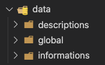

<br/>

<p id="data-folder-list">Table of content of this section:</p>

1. [Global folder](#global-folder)

2. [Descriptions folder](#descriptions-folder)

3. [Informations folder](#informations-folder)

<br/>

<h3 id="global-folder">1. Global folder <a href="#data-folder-list">⬆</a></h3>

First, let me explain the global folder (because many files depend on it).

Below is an example of global folder content:

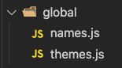

As we can see above, there are two files: names.js, which contains all names in the project (string types written as variables to avoid typos), and themes.js, which contains three themes (appropriate color combinations) that can be set by the user via the Theme.js object (this process is explained later).

<br/>

The following is an example of abbreviated names.js file:

```js
//data/global/names.js file:

export const common = {
  headline: 'headline',
  title: 'title',
  image: 'image',
  paragraph: 'paragraph',
  link: 'link',
  code: 'code',
  theme: 'theme',
  submit: 'submit',
  fieldname: 'fieldname',
  message: 'message',
  listeners: 'listeners',
  attributes: 'attributes',
  classes: 'classes',
  styles: 'styles',
  TEXTAREA: 'TEXTAREA',
  type: 'type',
  object: 'object',
  header: 'header',
  list: 'list',
  image: 'image',
  break: 'break',
  email: 'email',
}

export const types = {
  string: 'string',
}

export const toggleValue = {
  on: 'on',
  off: 'off',
}

export const elements = {
  canvas: 'canvas',
  div: 'div',
  button: 'button',
  input: 'input',
  img: 'img',
  audio: 'audio',
  h: (value) => `h${value}`,
  a: 'a',
  p: 'p',
  pre: 'pre',
  code: 'code',
  form: 'form',
  label: 'label',
  textarea: 'textarea',
  span: 'span',
  ul: 'ul',
  li: 'li',
  br: 'br',
}

more code here...
```

<br/>

As we can see in the example above, objects contain properties in the form of different names that contain string values. In some cases, a function was used to make it easier to specify a given name, for example:

```js
//data/global/themes.js file:

h: (value) => `h${value}`
```

Thanks to above solution, I can provide a different html value for the `<h></h>` tag.

<br/>

Below is an example of the content of the themes.js file (second file in global folder):

```js
//data/global/themes.js file:

export default {
  black: {
    mainColor: 'rgb(18, 18, 18)',
    mainColorTransparent: 'rgba(18, 18, 18, 0.8)',

    secondaryColor: 'rgb(0,0,0)',
    secondaryColorTransparent: 'rgba(0, 0, 0, 0.8)',

    borderColor: 'rgb(85 ,85, 85)',

    strokeColor: '85 ,85, 85',
    ctxFillStyle: 'rgb(85 ,85, 85)',

    mainText: 'rgb(255,255,255)',
    secondaryText: 'rgb(238,238,238)',

    themeDotBorder: 'rgb(255,255,255)',

    previewBg: 'rgb(34,34,34)',
    previewShadow: 'rgb(18,18,18)',

    buttonColor: 'rgb(51,51,51)',
  },

  blue: {
    mainColor: 'rgb(21, 32, 43)',
    mainColorTransparent: 'rgba(21, 32, 43, 0.8)',

    secondaryColor: 'rgb(25, 39, 52)',
    secondaryColorTransparent: 'rgba(25, 39, 52, 0.8)',

    borderColor: 'rgb(57, 119, 179)',

    strokeColor: '57, 119, 179',
    ctxFillStyle: 'rgb(57, 119, 179)',

    mainText: 'rgb(255,255,255)',
    secondaryText: 'rgb(238,238,238)',

    themeDotBorder: 'rgb(255,255,255)',

    previewBg: 'rgb(25, 39, 52, 0.8)',
    previewShadow: 'rgb(17,25,33)',

    buttonColor: 'rgb(33,69,105)',
  },

  purple: {
    mainColor: 'rgb(70, 52, 78)',
    mainColorTransparent: 'rgba(70, 52, 78, 0.8)',

    secondaryColor: 'rgb(56, 42, 63)',
    secondaryColorTransparent: 'rgba(56, 42, 63, 0.8)',

    borderColor: 'rgb(154, 0, 154)',

    strokeColor: '154, 0, 154',
    ctxFillStyle: 'rgb(154, 0, 154)',

    mainText: 'rgb(255,255,255)',
    secondaryText: 'rgb(238,238,238)',

    themeDotBorder: 'rgb(255,255,255)',

    previewBg: 'rgb(29, 21, 32, 0.8)',
    previewShadow: 'rgb(43,32,47)',

    buttonColor: 'rgb(92,54,105)',
  },
}
```

As we can see above, the file contains three objects that have a different color combination for a given theme (black, blue and purple). It should be mentioned that the strokeColor property value of the theme object is specific because of one of the methods logic of the Particles object in which it is used (this will be explained when discussing the Particles object).

<br/>

<h3 id="descriptions-folder">2. Descriptions folder <a href="#data-folder-list">⬆</a></h3>

In the case of the next folder (of data folder) called descriptions, there are:

- sites folder (contains descriptions related to different sites and sections on the site),
- structure.js (contains the description structure),
- index.js (for exporting files).

<br/>

Below is an example of description folder content:

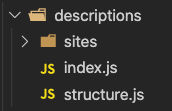

<br/>

First, I'd like to explain the structure.js file as that is where all the descriptions in the sites folder are based on. Below is the content of the discussed file:

```js
//data/descriptions/structure.js file:

import { classNames, common, elements } from '/data/global/names.js'
import { txtAlign, elPosition, programmingLngs } from '/data/global/names.js'

const { m, text, border, w, position } = classNames.utilities

const structure = {
  h: (
    content,
    {
      size = 3,
      mt = 60,
      mb = 20,
      align = txtAlign.left,
      smAlign = txtAlign.left,
      underline,
      id,
    } = {}
  ) => {
    return {
      type: common.header,
      size,
      content,
      id,
      classes: (() => {
        const classesSet = []

        classesSet.push(m.t(mt))
        classesSet.push(m.b(mb))
        classesSet.push(text[align])
        classesSet.push(text.sm[smAlign])

        underline && classesSet.push(text.underline)

        return classesSet
      })(),
    }
  },

  p: (
    content,
    {
      my = 10,
      align = txtAlign.justify,
      smAlign = txtAlign.left,
      lh = 25,
      id,
    } = {}
  ) => {
    return {
      type: common.paragraph,
      element: elements.p,
      content,
      id,
      classes: (() => {
        const classesSet = []

        classesSet.push(m.y(my))
        classesSet.push(text[align])
        classesSet.push(text.lh(lh))
        classesSet.push(text.sm[smAlign])

        return classesSet
      })(),
    }
  },

  im: (imgPath, { mt = 10, mb = 20, maxWidth } = {}) => {
    return {
      type: common.image,
      element: elements.img,
      path: `/images/projects/${imgPath}`,
      classes: (() => {
        const classesSet = []

        classesSet.push(border.rounded)
        classesSet.push(w.full)
        classesSet.push(m.t(mt))
        classesSet.push(m.b(mb))
        maxWidth && classesSet.push(w.max(maxWidth))

        return classesSet
      })(),
    }
  },

  c: (content, { lng } = {}) => {
    return {
      type: common.code,
      elements: { pre: elements.pre, code: elements.code },
      content,
      classes: {
        code: [
          lng
            ? `${common.language}-${lng}`
            : `${common.language}-${programmingLngs.js}`,
        ],
        pre: [
          lng
            ? `${common.language}-${lng}`
            : `${common.language}-${programmingLngs.js}`,
        ],
      },
    }
  },

  l: (
    content,
    {
      listAlign = txtAlign.justify,
      listSmAlign = txtAlign.left,
      listPosition = elPosition.relative,
      itemMb = 15,
      itemMl = 20,
      itemDash = true,
      listSize,
    } = {}
  ) => {
    return {
      type: common.list,
      elements: {
        list: elements.ul,
        item: elements.li,
      },
      content,
      classes: (() => {
        return {
          list: (() => {
            const classesSet = []

            classesSet.push(position[listPosition])
            classesSet.push(text[listAlign])
            classesSet.push(text.sm[listSmAlign])

            listSize && classesSet.push(text.size(listSize))

            return classesSet
          })(),

          item: (() => {
            const classesSet = []
            classesSet.push(m.b(itemMb))
            classesSet.push(m.l(itemMl))
            itemDash && classesSet.push(text.dash)

            return classesSet
          })(),

          lastItem: (() => {
            const classesSet = []
            classesSet.push(m.l(itemMl))
            itemDash && classesSet.push(text.dash)

            return classesSet
          })(),
        }
      })(),
    }
  },

  b: () => {
    return { type: common.break }
  },

  // only use within another tag:

  a: (label, path) => {
    return path && path.includes('#')
      ? `<a class="text-bold text-white" href=${path}>${label}</a>`
      : `<a href=${path} rel="noopener noreferrer nofollow" 
    target="_blank">${label}</a>`
  },
}

const { h, p, im, c, l, b, s, a } = structure

export { h, p, im, c, l, b, s, a }
```

As we can see above, it is a file that contains the object named structure, which consists of functions that return objects with appropriate information (element to be created, content, classes, etc.).

For a function assigned to the "a" key of structure object, html tag (a) is returned to make it easier to link somewhere inside another tag, for example inside header or paragraph text (it can only be used within another tag).

<br/>

Presented above functions are assigned to variables (keys of structure object), the names of which are associated with the following html elements:

```
h - <h></h>,
p - <p></p>,
im - ,
c - < pre><code></code></pre>,
l - <ul><li></li> </ul>,
b - <br/>,
s - <strong></strong>,
a - <a></a>
```

<br/>

To understand well how to create descriptions using the above-mentioned solution, below is a fragment of the TalkToGisapiaAndTheOthers project description:

```js
//data/descriptions/sites/talkToGisapiaAndTheOthers.js file:

import { h, p, im, c, l, b, a } from '/data/descriptions/structure.js'
import { txtAlign, programmingLngs } from '/data/global/names.js'

const folder = (path) => `TalkToGisapiaAndTheOthers/${path}`

export default [
  h(`App description`, {
    align: txtAlign.center,
    size: 2,
    mt: 10,
    smAlign: txtAlign.center,
  }),

  p([
    'To facilitate navigation within the description, each section title links to the corresponding section. However, through the arrow ⬆ in the title of a specific section, you can refer to the closest list of specific sections.',
  ]),

  h(`Table of contents:`, { id: 'table-of-contents' }),

  l(
    [
      a('1. Introduction', '#introduction'),
      a('2. Technologies', '#technologies'),
      a('3. Features', '#features'),
    ],
    {
      itemDash: false,
      listSize: 20,
      itemMl: 5,
    }
  ),

  b(),

  h(`1. Introduction ${a('⬆', '#table-of-contents')}`, { id: 'introduction' }),

  p([
    `The app allows You to write messages in two languages (PL/ENG) with 3 different characters who can collect information provided via the messenger by user, use them data during the conversation and send in an interesting form to the user e-mail.`,
  ]),

  b(),

  p([
    `Live version is ${a('here', 'https://talktogisapiaandtheothers.pl/')}.`,

    `Github is ${a(
      'here',
      'https://github.com/damian-lis/talk-to-gisapia-and-the-others'
    )}.`,
  ]),

  b(),

  p([`Below is the desktop version of the app:`]),

  im(folder(`introDesktop.gif`)),

  p([`Below is the mobile version of the app:`]),

  im(folder(`introMobile.gif`)),

  h(`2. Technologies ${a('⬆', '#table-of-contents')}`, { id: 'technologies' }),

  p([`The following technologies were used in the project:`]),

  l([`HTML`, `CSS`, ` Javascript (OOP)`, `GSAP`]),

  h(`3. Features ${a('⬆', '#table-of-contents')}`, { id: 'features' }),

  p([
    `Most of the project is built in oop javascript for a very in-depth understanding of the language. The list of the most interesting solutions is presented below:`,
  ]),
```

As we can see above, creating the entire description is as simple as using appropriate functions (which we can modify for our own needs through the configuration object) that return specific information (objects) that are placed in the array.

Next, this data is processed by the DescriptionArrange object, which converts this information into a real description, which is added to the indicated place. The entire explanation of the DescriptionArrange object logic is (<a href="#descriptionarrange-object">here</a>).

<br/>

<h3 id="informations-folder">3. Informations folder <a href="#data-folder-list">⬆</a></h3>

The last folder in the data folder is named informations, which contains files with various data, e.g. information about form fields and projects sneak peeks.

<br/>

Below is an example of informations folder content:

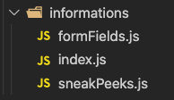

<br/>

In order to illustrate the content of the files regarding the informations folder, below there is an example file with informations about form fields:

```js
//data/informations/formFields.js file:

import { common } from '/data/global/names.js'

export default [
  {
    label: common.Name,
    type: common.text,
    name: common.name,
    notifications: ['name is required 😡'],
  },
  {
    label: common.Subject,
    type: common.text,
    name: common.subject,
    notifications: ['subject is required 😡'],
  },
  {
    label: common.Email,
    type: common.email,
    name: common.email,
    notifications: ['email is required 😡', 'invalid email 😡'],
  },
  {
    label: common.Message,
    type: common.textarea,
    name: common.message,
    notifications: ['message is required 😡'],
  },
  {
    type: common.submit,
    value: common.Send,
    name: common.submit,
    notifications: [
      'Please wait a moment! 🕐',
      'literally a moment! 🛩',
      'almost, almost! 🚀',
    ],
  },
]
```

As we can see in the example above, it is a collection of information about form fields, which has a certain structure on the basis of which the Form object can use appropriate logic to build form fields elements (similar principle of operation as in the case of the files of the descriptions folder). The entire process will be explained when discussing the Form object.

<br/>

<h3 id="scripts-folder">3.1.2. Description of the structure and content of the scripts folder <a href="#general-main">⬆</a></h3>

The scripts folder contains four folders: helpers, objects, plugins and sites and its content is shown below:

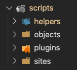

<br/>

<p id="scripts-folder-list">Table of content of this section:</p>

1. [Helpers folder](#helpers-folder)

2. [Objects folder](#objects-folder)

3. [Plugins folder](#plugins-folder)

4. [Sites folder](#sites-folder)

<br/>

<h3 id="helpers-folder">1. Helpers folder <a href="#scripts-folder-list">⬆</a></h3>

In the case of the helpers folder, we deal with files that contain functions that are responsible for specific logic and are reusable throughout the project (they can also be used in other projects). They play the role of support functions that increase the readability of the code and the developer experience.

<br/>

Below is an example of the helpers folder content:

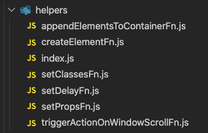

<br/>

To better understand the logic of the page, which I will describe in the general section, I would like to briefly explain the logic of each of the helpers.

<p id="helpers-list">Helpers list:</p>

&nbsp; 1.1. [appendElementsToContainerFn](#appendelementstocontainerfn)

&nbsp; 1.2. [createElementFn](#createelementfn)

&nbsp; 1.3. [setClassesFn](#setclassesfn)

&nbsp; 1.4. [setPropsFn](#setpropsfn)

&nbsp; 1.5. [setDelayFn](#setdelayfn)

&nbsp; 1.6. [triggerActionOnWindowScrollFn](#triggeractiononwindowscrollfn)

<br/>

<h3 id="appendelementstocontainerfn">1.1 appendElementsToContainerFn <a href="#helpers-list">⬆</a></h3>

###

The first helper in the order is appendElementsToContainerFn which is responsible for attaching elements to the container.

<br/>

Its implementation is shown below:

```js
//scripts/helpers/appendElementsToContainerFn.js file:

import { types } from '/data/global/names.js'

export default ({ elements, container }) => {
  if (!container || !elements) return

  let containerEl = container

  if (typeof container === types.string) {
    containerEl = document.querySelector(container)
  }

  elements.map((element) => {
    let el = element

    if (typeof element === types.string) {
      el = document.querySelector(innerEl)
    }

    if (Array.isArray(el)) {
      const innerEls = el
      innerEls.map((innerElement) => {
        let innerEl = innerElement

        if (typeof innerElement === types.string) {
          innerEl = document.querySelector(innerElement)
        }
        containerEl.appendChild(innerEl)
      })
    } else containerEl.appendChild(el)
  })

  return containerEl
}
```

As we can see above, it is a function that destructs an object into:

- an array with elements (or elements references on the basis of which these elements are searched) to be attached to container,
- the container element (or container element reference on the basis of which the container element is searched) to which mentioned elements are to be attached.

<br/>

In the body of a function we have a logic in which:

- the passed values are checked (without them, the function will not execute its logic),
- when references have been passed to the function, appropriate elements are searched for in the DOM structure on their basis,
- the elements are attached to the container element based on the map method.

<br/>

To understand how to use this helper in practice, below is an example of its use in createMainComponents method of Form object:

```js
//scripts/objects/Form.js file:

this.titleComponent = appendElementsToContainerFn({
  elements: [this.title, this.whisper, this.infoComponent],
  container: this.titleContainer,
})
```

As we can see in the above example, we pass to the helper function an object with elements (this.title, this.whisper, this.infoComponent) to be attached and a container (this.titleContainer) to which we want to attach these elements.

<br/>

<h3 id="createelementfn">1.2. createElementFn <a href="#helpers-list">⬆</a></h3>

Next helper that I would like to briefly describe is createElementFn, which is used most often within the logic of the app and is used to create any html element with various properties.

<br/>

Its implementation is shown below:

```js
//scripts/helpers/createElementFn.js file:

import { common } from '/data/global/names.js'

export default ({ element, ...rest }) => {
  if (!element) return

  const createdElement = document.createElement(element)

  if (Object.keys(rest).length) {
    for (const propEl in rest) {
      switch (propEl) {
        case common.listeners:
          rest[propEl].map((listener) => {
            const { event, cb } = listener
            createdElement.addEventListener(event, (e) => cb(e))
          })
          break

        case common.attributes:
          rest[propEl].map((attribute) =>
            createdElement.setAttribute(
              `${attribute.name}`,
              `${attribute.value}`
            )
          )
          break

        case common.classes:
          createdElement.classList.add(...rest[propEl])
          break

        case common.styles:
          rest[propEl].map(
            (styleObj) => (createdElement.style[styleObj.name] = styleObj.value)
          )
          break

        default:
          if (
            createdElement.tagName === common.TEXTAREA &&
            propEl === common.type
          )
            break
          createdElement[propEl] = rest[propEl]
      }
    }
  }
  return createdElement
}
```

As we can see in the above example, the function destructs the passed object into:

- an element name (on this basis the element will be created),
- the properties, which will be added to the created element (rest properties of passed object)

<br/>

In the body of a function we have a logic in which:

- the passed element reference is checked (if not sent, the function is returned) and then created element on their basis,
- a switch statement is used so that we can easily assign the passed properties to the created element in an appropriate way,
- at the end, the created element with its properties is returned.

<br/>

To understand how to use this helper in practice, below is an example of its use in createElements method of Audio object:

```js
//scripts/objects/Audio.js file:

this.btn = createElementFn({
  element: elements.button,
  classes: [classNames.global.leftBtn],
  listeners: [{ event: events.click, cb: () => this.handleAudio() }],
})
```

As we can see in the above example, we pass an object with the name of button element, appropriate class refeferences (classNames.global.leftBtn) and listeners (with event and cb) to the function.

<br/>

<h3 id="setclassesfn">1.3. setClassesFn <a href="#helpers-list">⬆</a></h3>

The next helper in the order is setClassesFn which is responsible for setting different classes for different elements.

<br/>

Its implementation is shown below:

```js
//scripts/helpers/setClassesFn.js file:

import { types, toggleValue } from '/data/global/names.js'

export default ({ toggle, objs, delay }) => {
  if (!objs) return

  const helperLogic = () => {
    objs.map((obj) => {
      if (!obj.classes) return

      if (obj.elements) {
        obj.elements.map((element) => {
          let el = element

          if (typeof element === types.string) {
            el = document.querySelector(element)
          }

          obj.classes.map((classEl) => {
            if (obj.removeFromElements) {
              obj.removeFromElements.map((removeFromElement) => {
                let removeFromEl = removeFromElement

                if (typeof removeFromElement === types.string) {
                  removeFromEl = document.querySelector(element)
                }

                removeFromEl.classList.remove(classEl)
                removeFromEl.disabled = false
              })
            }

            if (obj.initialClass) {
              el.className = obj.initialClass
            }

            if (toggle) {
              switch (toggle) {
                case toggleValue.on:
                  el.classList.add(classEl)
                  el.disabled = false
                  break
                case toggleValue.off:
                  el.classList.remove(classEl)
                  el.disabled = true
                  break

                default:
                  break
              }
            } else {
              el.classList.add(classEl)
            }
          })
        })
      } else {
        obj.classes.map((classEl) => {
          if (obj.removeFromElements) {
            obj.removeFromElements.map((removeFromElement) => {
              let removeFromEl = removeFromElement

              if (typeof removeFromElement === types.string) {
                removeFromEl = document.querySelector(element)
              }

              removeFromEl.classList.remove(classEl)
              removeFromEl.disabled = false
            })
          }
        })
      }
    })
  }

  if (delay) return setTimeout(helperLogic, delay)
  helperLogic()
}
```

As we can see in the above example, the function destructs the passed object into:

- toggle which takes the "on" or "off" values thanks to which we can easily set or delete passed classes on passed elements,
- objs which containing an array with objects with elements (or elements references on the basis of which the elements will be found and on which we set or remove classes), classes (to set or remove on elements), removeFromElements (or elements references on the basis of which the elements will be found and on which we remove classes) and initialClass (default passed element class),
- delay with time number so we can delay setting or deleting passed classes.

<br/>

In the body of a function we have a logic in which:

- the passed objs is checked (if not sent, the function is returned),
- a DOM elements are searched if the passed elements are a reference,
- the helperLogic function is created, in which, classes on the elements are added or removed depending on the arguments passed to helper,
- at the very end, when the delay value has been passed to the function, the setTimeout function is called with created helperLogic function and returned in the helper (because of the setTimeout specific id that it returns), if delay value is not passed, the helperLogic function itself is called.

<br/>

To understand how to use this helper in practice, below is an example of its use in toggleFormTextInputsNotification method of Form object:

```js
//scripts/objects/Form.js file:

setClassesFn({
  toggle,
  objs: [
    {
      elements: inputs,
      classes: [classNames.utilities.border.danger],
    },
  ],
})
```

As we can see in the above example, to the helper an object is passed with:

- a toggle value "on"/"off" (thanks to this, we decide whether we want to add classes to elements or not),
- objs as array of objects with elements (in this case inputs) and a classes (in this case class that changes the input border color to red).

<br/>

Before going further, I would like to add that the toggle parameter does not need to be passed to the helper (without it, by the default classes will only be set to elements).

<br/>

<h3 id="setpropsfn">1.4. setPropsFn <a href="#helpers-list">⬆</a></h3>

Going forward, next helper in the sequence is called setPropsFn, whose logic is very similar to the previous setClassesFn helper and differs only in that instead of setting or removing classes on the passed elements, it sets various properties (also style properties).

<br/>

Its implementation is shown below:

```js
//scripts/helpers/setPropsFn.js file:

import { types, toggleValue } from '/data/global/names.js'

export default ({ toggle, objs, delay }) => {
  if (!objs) return

  const helperLogic = () => {
    objs.map((obj) => {
      if (!obj.classes) return

      if (obj.elements) {
        obj.elements.map((element) => {
          let el = element

          if (typeof element === types.string) {
            el = document.querySelector(element)
          }

          obj.classes.map((classEl) => {
            if (obj.removeFromElements) {
              obj.removeFromElements.map((removeFromElement) => {
                let removeFromEl = removeFromElement

                if (typeof removeFromElement === types.string) {
                  removeFromEl = document.querySelector(element)
                }

                removeFromEl.classList.remove(classEl)
                removeFromEl.disabled = false
              })
            }

            if (obj.initialClass) {
              el.className = obj.initialClass
            }

            if (toggle) {
              switch (toggle) {
                case toggleValue.on:
                  el.classList.add(classEl)
                  el.disabled = false
                  break
                case toggleValue.off:
                  el.classList.remove(classEl)
                  el.disabled = true
                  break

                default:
                  break
              }
            } else {
              el.classList.add(classEl)
            }
          })
        })
      } else {
        obj.classes.map((classEl) => {
          if (obj.removeFromElements) {
            obj.removeFromElements.map((removeFromElement) => {
              let removeFromEl = removeFromElement

              if (typeof removeFromElement === types.string) {
                removeFromEl = document.querySelector(element)
              }

              removeFromEl.classList.remove(classEl)
              removeFromEl.disabled = false
            })
          }
        })
      }
    })
  }

  if (delay) return setTimeout(helperLogic, delay)
  helperLogic()
}
```

Due to the very similarity of logic to the previous helper, I will not focus on its description here.

<br/>

To understand how to use this helper in practice, below is an example of its use in toggleFormTextInputsNotification method of Form object:

```js
//scripts/objects/Curtain.js file:

setPropsFn({
  toggle,
  objs: [
    {
      elements: [document.body],
      styleProps: [
        {
          name: styleProps.names.overflow,
          values: {
            on: styleProps.values.hidden,
            off: styleProps.values.auto,
          },
        },
      ],
    },
  ],
})
```

As we can see above, the use of this helper is also very similar to the setClassesFn helper. The difference is that instead of classes, we list here various properties (in this case style properties) specifying the property name and its value to be set on the elements.

<br/>

<h3 id="setdelayfn">1.5. setDelayFn <a href="#helpers-list">⬆</a></h3>

The next very short helper is setDelayFn, which allows you to set a delay for some functions.

<br/>

Its implementation is shown below:

```js
//scripts/helpers/setDelayFn.js file:

export default async (delay = 0) => {
  typeof delay === 'number' &&
    (await new Promise((resolve) => setTimeout(() => resolve(), delay)))
}
```

As we can see in the example above, the function takes the value of delay, which is set to 0 by default.

In the body of a function we have a logic in which:

- the type of the passed delay value is checked (number),
- the operation of returning the so-called promise is performed, the delay (passed value) of which is simulated by the setTimeout function

<br/>

To understand how to use this helper in practice, below is an example of its use in handleFormSubmit method of Form object:

```js
//scripts/objects/Form.js file:

this.revealTitleWhisper()
await setDelayFn(2000)
this.setSelfDestructEventToMainComponent()
```

As we can see in the above example, the setSelfDestructEventToMainComponent method is executed 2 seconds later than the previous one (revealTitleWhisper method) due to the use of this helper.

<br/>

<h3 id="triggeractiononwindowscrollfn">1.6. triggerActionOnWindowScrollFn <a href="#helpers-list">⬆</a></h3>

The last of the helpers available in the project is triggerActionOnWindowScrollFn helper, which is responsible for triggering the appropriate actions within or outside the so-called trigger element.

<br/>

Its implementation is shown below:

```js
// scripts/helpers/triggerActionOnWindowScrollFn.js file:

import { types, events } from '/data/global/names.js'

export default ({
  onWhatElement: trigerElement,
  cbOnEnterTriggerEl = () => {},
  cbOnExitTriggerEl = () => {},
  modifier = 0,
}) => {
  if (!trigerElement) return

  let flag = true
  let element = trigerElement

  if (typeof trigerElement === types.string) {
    element = document.querySelector(trigerElement)
  }

  window.addEventListener(events.scroll, () => {
    if (
      window.innerHeight + window.pageYOffset - modifier >
      element.offsetTop
    ) {
      flag && cbOnEnterTriggerEl(element)
      flag = false
    } else {
      !flag && cbOnExitTriggerEl(element)
      flag = true
    }
  })
}
```

As we can see in the above example, the function destructs the passed object into:

- triggerElement (renamed from onWhatElement) on the basis of which appropriate actions are triggered,
- the cbOnEnterTriggerEl function that is to be called when the triggerElement is exceeded during the window scroll (by default it returns a function to avoid errors),
- the cbOnExitTriggerEl function to be called when the triggerElement is leaved during the window scroll (by default it returns a function to avoid errors),
- the so-called modifier, thanks to which we can slightly change the place where the action is triggered relative to the triggerElement (when there is no value given, the value of 0 is taken by default, where the action call stays in the point of the triggerElement).

<br/>

In the body of a function we have a logic in which:

- we check whether a given element trigger has been sent (if not, the whole function is returned to avoid an error),
- if a trigger element reference was sent to the function, then on its basis the given element is searched in the DOM structure and assigned to the variable element,
- at the very end we have an event listener whose event is set to scroll and calls a function in which when the screen scroll aligns with the top edge of the tigger element, the cbOnEnterTriggerEl function is triggered, otherwise the cbOnExitTriggerEl function (a flag is set to prevent nonsensical calls of the same function when scrolling).

<br/>

I would also like to point out that when changing the screen layout, e.g. from desktop to mobile, the place where the action is triggered is recalculated.

<br/>

To understand how to use this helper in practice, below is an example of its use in constructor of SneakPeeks object:

```js
//scripts/objects/SneakPeeks.js file:

triggerActionOnWindowScrollFn({
  onWhatElement: trigger,
  cbOnEnterTriggerEl: () =>
    this.toggleBtnComponent({ toggle: toggleValue.off }),
  cbOnExitTriggerEl: () => this.toggleBtnComponent({ toggle: toggleValue.on }),
  modifier: 80,
})
```

As we can see above, an object with a trigger element is passed to the helper, toggleBtnComponent method that will be called with a different toggle value depending on the location of trigger element, and a modifier with a value of 80 which changes the trigger element location.

<br/>

<h3 id="objects-folder">2. Objects folder <a href="#scripts-folder-list">⬆</a></h3>

Moving down the scripts folder structure we have an objects folder, the content of which look like this:


The objects folder contains files with objects (classes) with appropriate methods, the structure of which is very similar due to the use of helper functions.

These class objects were introduced to help manage the logic of certain components on the pages and to practice deeply object oriented programming.

<br/>

Below is an example of a combination of two objects (SneakPeeks.js and Audio.js) to show the similarities of properties and methods:

```js
//scripts/objects/SneakPeeks.js file:

import {
  createElementFn,
  triggerActionOnWindowScrollFn,
  appendElementsToContainerFn,
  setClassesFn,
} from '/scripts/helpers/index.js'
import { classNames, info, elements } from '/data/global/names.js'

class SneakPeeks {
   constructor({ container, trigger, wrapper, data }) {
    this.sneakPeeksInfo = data

    this.createElements()
    this.createComponents()
    appendElementsToContainerFn({ elements: [this.mainComponent], container })

    if (trigger) {
      this.triggerElement = document.querySelector(trigger)
      this.wrapperElement = document.querySelector(wrapper)
      triggerActionOnWindowScrollFn({
        onWhatElement: trigger,
        cbOnEnterTriggerEl: () => this.handleOnEnterTriggerEl(),
      })
    }
  }

  createElements() {
    this.mainContainer = createElementFn({
      element: elements.div,
      classes: [classNames.sneakPeeks.container],
    })

    more code here...
  }

  createComponents() {
   more code here...

    this.mainComponent = appendElementsToContainerFn({
      elements: this.sneakPeekComponents,
      container: this.mainContainer,
    })
  }

  //more code here...
}
```

<br/>

```js
//scripts/objects/Audio.js file:

import {
  createElementFn,
  triggerActionOnWindowScrollFn,
  appendElementsToContainerFn,
  setPropsFn,
} from '/scripts/helpers/index.js'
import {
  classNames,
  paths,
  common,
  elements,
  styleProps,
  events,
} from '/data/global/names.js'

class Audio {
  constructor({ container, trigger, path }) {
    this.play = false
    this.path = path

    this.createElements()
    this.createComponents()
    appendElementsToContainerFn({ elements: [this.btnComponent], container })

    trigger &&
      triggerActionOnWindowScrollFn({
        onWhatElement: trigger,
        cbOnEnterTriggerEl: () =>
          this.toggleBtnComponent({ toggle: toggleValue.off }),
        cbOnExitTriggerEl: () =>
          this.toggleBtnComponent({ toggle: toggleValue.on }),
        modifier: 80,
      })
  }

  createElements() {
    this.audio = createElementFn({
      element: elements.audio,
      src: this.path,
    })

    this.btn = createElementFn({
      element: elements.button,
      classes: [classNames.global.leftBtn],
      listeners: [{ event: events.click, cb: () => this.handleAudio() }],
    })

    this.audioImg = createElementFn({
      element: elements.img,
      src: paths.pauseImg,
    })
  }

  createComponents() {
    this.btnComponent = appendElementsToContainerFn({
      elements: [this.audioImg],
      container: this.btn,
    })
  }

  //more code here...
}
```

We can see in the above examples that methods such as createElements, createComponents and used helpers such as createElementsFn , appendElementsToContainerFn and triggerActionOnWindowScrollFn in both objects are the same (the rest of the objects are very similar).

<br/>

In constructor of the presented above objects we have similarities in:

- the createElements method that is responsible for creating elements with properties through the createElementFn helper,
- the createComponents method by appendElementsToContainerFn helper for creating components from previously created elements,
- appending the created components to the container passed to the object by appendElementsToContainerFn,
- calling the triggerActionOnWindowScrollFn helper with the appropriate elements.

<br/>

Such a structure was designed to ensure ease of development and increase the developer experience.

<br/>

<h3 id="plugins-folder">3. Plugins folder <a href="#scripts-folder-list">⬆</a></h3>

The next folder is the plugins folder, which contains files related to various packages that help in the development of the project.

<br/>

Below is an example of plugins folder content::

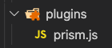

As we can see above, in the plugins folder there is only the prism.js file, which is responsible for the appropriate arrangement of the code presented on the page. The second file of this package is in the styles/plugins/prism.css folder, which is responsible for the appropriate styles in the presented code. (examples will be later in the description).

<br/>

Below is an visual example of using PrismJS plugin:

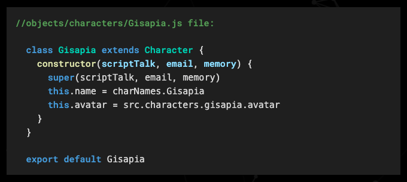

<br/>

<h3 id="sites-folder">4. Sites folder <a href="#scripts-folder-list">⬆</a></h3>

The last folder in this scripts folder structure is the sites folder, the content of which are shown below:

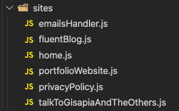

In the example above, we can see that the sites folder contains various js files with the names of individual site that act as main scripts used on the html files of a specific site (home.js corresponds to index.html file).

<br/>

Here I would also like to add that all html files for subpages are in the sites folder (index.html (home) is out). Below is the sites folder with html files that are related to the subpages:

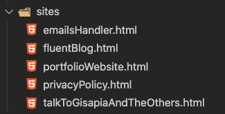

Each of the js files in sites folder is responsible for generating appropriate instances of classes that play a specific role on the site (handling a specific functionality on the website).

<br/>

To illustrate the content of these files, index.js file was used, which is the main script of index.html:

```js
//scripts/sites/index.js file:

import themes from '/data/global/themes.js'
import { idReferences, paths } from '/data/global/names.js'
import { formFieldsInfo, sneakPeeksInfo } from '/data/informations/index.js'
import {
  skillsDescription,
  aboutDescription,
} from '/data/descriptions/index.js'
import {
  Audio,
  Form,
  SneakPeeks,
  Theme,
  Particles,
  DescriptionArrange,
} from '/scripts/objects/index.js'

new DescriptionArrange({
  container: idReferences.about.description,
  data: aboutDescription,
})
new DescriptionArrange({
  container: idReferences.skills.description,
  data: skillsDescription,
})
new Theme({
  container: idReferences.theme.main,
  themesObj: themes,
  background: {
    Object: Particles,
    objContainer: idReferences.global.mainContainer,
  },
})
new Audio({
  container: idReferences.global.leftContainer,
  trigger: idReferences.sneakPeeks.trigger,
  path: paths.mainPageIntroduction,
})
new Form({
  container: idReferences.global.leftContainer,
  trigger: idReferences.sneakPeeks.trigger,
  data: formFieldsInfo,
})

new SneakPeeks({
  container: idReferences.sneakPeeks.main,
  trigger: idReferences.sneakPeeks.trigger,
  wrapper: idReferences.sneakPeeks.wrapper,
  data: sneakPeeksInfo,
})
```

In the example above, we can see that various class objects are imported into the file, which are used to create instances of these classes. Each of the created instances is responsible for some part of the logic on the site, e.g. on the main page we have to create:

- a description of my person and my skills (new DescriptionArrange),
- audio support (new Audio),
- form support (new Form),
- theme support (new Theme)
- sneak peeks of completed projects (new SneakPeeks).

<br/>

Each of the created instances accepts object with similar elements like container, trigger, data etc.

<br/>

To attach such a js file to the html file, we use a simple script tag, thanks to which we can import various functionalities to a given site (in this case to the index.html homesite):

```html
<!-- index.html file: -->

<script
  type="module"
  type="text/javascript"
  src="/scripts/sites/main.js"
></script>
```

Thanks to the solution presented in the whole point, it is very easy to add new functionalities to our website while keeping the code clean (the logic of each of the presented objects will be described later).

<br/>
<br/>

<h3 id="styles-folder">3.1.3. Description of the structure and contents of the styles folder <a href="#general-main">⬆</a></h3>

The styles folder consists of the components, global, plugins, and utilities folders (index.css at the end, which exports all local files).

<br/>

The following is an example of the styles folder content:

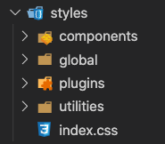

<br/>

<p id="styles-folder-list">Table of content of this section:</p>

1. [Components folder](#components-folder)

2. [Global folder](#global-folder)

3. [Plugins folder](#plugins-folder)

4. [Utilities folder](#utilities-folder)

<br/>

<h3 id="components-folder">1. Components folder <a href="#styles-folder-list">⬆</a></h3>

In the case of the first folder named components, we have style files in it that describe the individual components on the page.

<br/>

Below is an example of the components folder content:

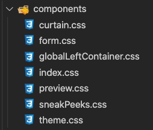

<br/>

In order to illustrate the content of the files, the fragment of form.css file was used, which contains classes and properties related to the form component:

```css
/* styles/components/form.css file: */

.form-main-container {
  width: 100%;
  max-width: 500px;
  height: 100%;
  max-height: 700px;
  padding: 10px;
  border: var(--borderColor) 1px solid;
  border-radius: 5px;
  background-color: var(--secondaryColor);
  transition: 1s;
  opacity: 0;
  transform: translateX(200%);
  animation: slideInFromRight 0.5s 0.5s ease-in forwards;
}

.form-main-container-inner {
  display: flex;
  flex-direction: column;
  height: 100%;
  overflow-y: auto;
}

.form-title-container {
  position: relative;
  top: 0;
  min-height: 70px;
  display: flex;
  flex-basis: 15%;
  justify-content: center;
  align-items: center;
  transition: 0.7s;
}

.form-title {
  text-align: center;
  transition: 0.7;
}
```

As we can see above, a simple css file with different styles for individual form elements.

<br/>

Below is a visual representation of the form component:

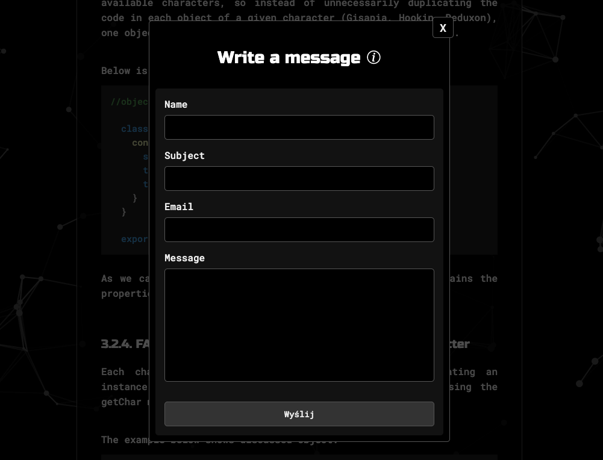

<br/>

<h3 id="global-folder">2. Global folder <a href="#styles-folder-list">⬆</a></h3>

In the case of the next folder named global, we deal with global styles.

<br/>

The content of this folder is shown below:

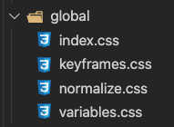

<br/>

As we can see in the above example, we deal with files such as:

- keyframes.css, in which the logic of individual animations is created,
- normalize.css with css style normalization,
- variables.css, in which the theme structure is initialized, which is then dynamically overwritten using the methods of the Theme.js object (this process will be described later),
- index.css to export local files.

<br/>

<h3 id="plugins-folder">3. Plugins folder <a href="#styles-folder-list">⬆</a></h3>

The next folder in the sequence of styles folder is the plugins folder which contains external (downloaded from the internet) files of style.

<br/>

The content of this folder is shown below:

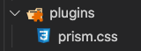

As we can see above, in this folder there is only one file called prism.css, thanks to which we have the appropriate coloring placed on the code page (part of the Prism.js package, the rest of which is in scripts/plugins/prism.js).

<br/>

Below is a visual example of this solution (in conjunction with scripts/plugins/prism.js):


<br/>

<h3 id="utilities-folder">4. Utilities folder <a href="#styles-folder-list">⬆</a></h3>

The last folder in the styles folder is called utilities, in which files containing appropriate classes were created that refer to the TailwindCSS and Bootstrap frameworks (a custom combination was created).

<br/>

The content of this folder is shown below:

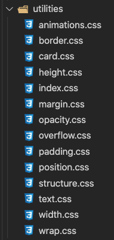

As we can see in the example above, we have a many style files that correspond to some style property. We also have sets of various properties that are often used together in a project, e.g. the card.css file.

<br/>

Below is an example of the card.css file:

```css
/* styles/utilities/card.css file: */

.card {
  padding: 10px;
  border: var(--borderColor) 1px solid;
  border-radius: 5px;
  background-color: var(--secondaryColor);
}

.card-inner {
  border-radius: 5px;
  background-color: var(--previewShadow);
}
```

It is also worth mentioning that the file structure.css is inspired by the Bootstrap framework, which includes row and column properties (with some own modifications).

<br/>

Below is an example of the structure.css file:

```css
/* styles/utilities/structure.css file: */

/* Row */
.row-xy {
  display: flex;
}

.row-x {
  display: flex;
}

.row-y {
  display: flex;
  flex-direction: column;
}

/* Column */
.col-10 {
  flex-basis: 10%;
}

.col-15 {
  flex-basis: 15%;
}

.col-20 {
  flex-basis: 20%;
}

.col-25 {
  flex-basis: 25%;
}

.col-30 {
  flex-basis: 30%;
}

.col-35 {
  flex-basis: 35%;
}
/* up to 100%...*/

@media screen and (max-width: 800px) {
  .row-xy {
    flex-direction: column;
  }
}
```

<br/>

To understand well how to use the styles presented above, I will use a fragment of the index.html structure:

```html
<!-- index.html file: -->

<section class="mb-40">
  <div
    class="card p-30 element-center pr-7 sm-wrap-x-500 sm-p-20 slideInFromLeft"
  >
    <div class="row-xy">
      <div class="col-45 content-center-xy sm-mb-10 showObject">
        
      </div>
      <div class="col-55 content-center-xy sm-mt-10 showObject">
        <div class="card-inner pl-30 pt-30 sm-pl-0">
          <div class="preview-container">
            <div id="preview-corner-tl" class="preview-corner"></div>
            <div id="preview-corner-tr" class="preview-corner"></div>
            <h3 class="mb-20 text-underline">What I do?</h3>
            <p>I am a Frontend Developer</p>
            <p>who creates web applications,</p>
            <p>sites and many other web solutions</p>
            <div id="preview-corner-br" class="preview-corner"></div>
            <div id="preview-corner-bl" class="preview-corner"></div>
          </div>
        </div>
      </div>
    </div>
  </div>
</section>
```

As we can see in the example above, we have a section element with only one utility class named mb-40 (margin-bottom: 40px) that contains a div element with classes named:

- card (properties that give us the appearance of the card),
- p-30 (padding:30px),
- element-center (element centering - margin:0 auto),
- pr-7 (padding-right:7px),
- sm-wrap-x-500 (max-width: 500px under the screen width of 800px - mobile version is indicated by the prefix sm),
- sm-p-20 (padding:20px up to 800px width)
- slideInFromLeft (an animation).

In the middle of the aforementioned div element there is an another div element with the classes named: row-xy (which refers to Bootstrap and in this case arranges elements horizontally x and vertically y by flex property).

Going further into the discussed html structure, we have two elements which are so-called columns with a width of 45% (col-45) and 55% (col-55) (modeled on bootstrap framework and refers to the flex-basis property: 45% and 55% - i.e. the element covers 45% and 55% of the parent space). I will not go into details further because the logic of the class notation has been well explained in my opinion.

It should be mentioned that due to the fact that the second so-called column (55%) of element with row-xy class contains more complex styles, a component preview has been separated here, the styles of which have been moved to the (styles/components/preview.css) folder in order not to make a mess in the code (such a solution was introduced in the entire project).

<br/>

So the general principle of creating styles in the project is that if the elements contain a large number of styles, the component is extracted and a css file for a given component is created.If there are fewer styles for a given element, classes from the utilities folder are used.

<br/>
<br/>

<h3 id="html-files">3.1.4. Characteristics of html files <a href="#general-main">⬆</a></h3>

In the case of html files, in addition to what was presented in the previous subsection, there is a global element that acts as a container, in which each part of the site is represented by a separate section.

In the project, we are dealing with the home site (index.html), the privacy policy site (privacyPolicy.html) and sites with descriptions of individual projects created by me (e.g sites/fluentBlog.html).

In some section elements, the html structure includes element marked with the id property that contain a comment referring to the code created by the specific object, e.g. <-- Theme object -->, which refers to the scripts/objects/Theme.js object.

The mentioned element with the id property acts as a container for the elements produced by the specific js object.

<br/>

Below is an example of such a solution of the index.html file:

```html
<!-- index.html file: -->

<section class="mb-30">
  <div
    class="card element-center wrap-x-700 px-30 pb-30 pt-30 sm-p-20 sm-wrap-x-500 slideInFromLeft"
  >
    <div class="row-y ">
      <div class="col-100 showObject">
        <div
          id="skills-description"
          class="card-inner row-y element-center p-20"
        >
          <!-- DescriptionArrange -->
        </div>
      </div>
    </div>
  </div>
</section>
```

In the example above, we have an element with id skills-description, which is a container for description elements generated by the DescriptionArrange object (scripts/objects/DescriptionArrange.js).

<br/>
<br/>
<br/>

<h2 id="specific">3.2. Specific <a href="#specific-main">⬆</a></h2>

This part of the description is related to the logic of individual objects that appear in the project. The description of each object is structured and is very similar in each case discussed.

<br/>

<h3 id="particles-object">3.2.1. Logic of background animation by Particles object <a href="#specific-main">⬆</a></h3>

<p id="particles-list">Table of content of this section:</p>

1. [Introdution](#particle-introduction)

2. [Description of the Particle object logic](#particle-logic)

3. [Description of the Particles object logic](#particles-logic)

<br/>

<h3 id="particle-introduction">1. Introdution <a href="#particles-list">⬆</a></h3>

In order to obtain a better user experience while using the website, an animated background has been introduced, which contains movable so-called particles that connect with each other by means of lines when they are brought closer to each other.

<br/>

Below is a visual example of the applied background:


To achieve the above effect, Particle and Particles objects were created.

<br/>

<h3 id="particle-logic">2. Description of the Particle object logic <a href="#particles-list">⬆</a></h3>

<p id="particle-logic-list">To make it easier to find yourself in the description below, there is a list of topics covered:</p>

&nbsp; 2.1. [Code example of the Particle object constructor](#particle-code-example)

&nbsp; 2.2. [Description of the variables in the constructor](#particle-constructor-variables)

&nbsp; 2.3. [Description of the draw method](#particle-draw-method)

&nbsp; 2.4. [Description of the update method](#particle-update-method)

<br/>

<h3 id="particle-code-example">2.1. Code example of the Particle object constructor <a href="#particle-logic-list">⬆</a></h3>

```js
//scripts/objects/Particle.js file:

class Particle {
  constructor(x, y, directionX, directionY, size, canvas, ctx) {
    this.canvas = canvas
    this.ctx = ctx
    this.x = x
    this.y = y
    this.directionX = directionX
    this.directionY = directionY
    this.size = size
    this.speedX = this.directionX
    this.speedY = this.directionY
  }
}
```

<br/>

<h3 id="particle-constructor-variables">2.2. Description of the variables in the constructor <a href="#particle-logic-list">⬆</a></h3>

As we can see in the code example in the constructor we have only following variables:

- this.canvas which assign the passed canvas element for particle,
- this.ctx which assign the passed context of canvas element for particle,
- this.x which assign passed x coordinate for particle,
- this.y which assign passed y coordinate for particle,
- this.directionX which assign x direction for particle,
- this directionY which assign y direction for particle,
- this.size which assign the passed size for particle,
- this.speedX which assign the passed speed of x coordinate for particle,
- this.speedY which assign the passed speed of y coordinate for particle

<br/>

<h3 id="particle-draw-method">2.3. Description of the draw method <a href="#particle-logic-list">⬆</a></h3>

Below is an implementation of draw method of discussed object:

```js
//scripts/objects/Particles.js file:

  draw() {
    this.ctx.beginPath()
    this.ctx.arc(this.x, this.y, this.size, 0, Math.PI * 2, false)
    this.ctx.fill()
  }
```

As we can see in the code example above, the draw method draws a given particle on the canvas using the methods of the ctx object (beginPath, arc, fill) based on the data that is in the constructor.

<br/>

<h3 id="particle-update-method">2.4. Description of the update method <a href="#particle-logic-list">⬆</a></h3>

Below is an implementation of update method of discussed object:

```js
//scripts/objects/Particles.js file:

  update() {
    if (this.x > this.canvas.width || this.x < 0) {
      this.directionX = -this.directionX
      this.speedX = this.directionX
    }
    if (this.y + this.size > this.canvas.height || this.y - this.size < 0) {
      this.directionY = -this.directionY
      this.speedY = this.directionY
    }

    this.x += this.directionX
    this.y += this.directionY

    this.draw()
  }
```

As we can see in the code example above, the update method updates the location on this canvas with the sent values (when the particles try to exceed the width and height of the canvas, the direction of the particle is changed, which gives the illusion of reflecting from the edge of the screen).

It is worth adding here that the whole process of the particle's movement is carried out by the for loop, which each time updates the position of the particle via the update method (will be presented in a moment in Particles object).

<br/>

<h3 id="particles-logic">3. Description of the Particles object logic <a href="#particles-list">⬆</a></h3>

In order to be able to create many such particles and make it move, the Particles object was created (which uses the previously discussed Particle object) with appropriate methods that enable it.

<br/>

<p id="particles-logic-list">To make it easier to find yourself in the description below, there is a list of topics covered:</p>

&nbsp; 3.1. [Code example of the constructor of the Particles object](#particles-code-example)

&nbsp; 3.2. [Description of the variables in the object constructor](#particles-constructor-variables)

&nbsp; 3.3. [Description of the setIsMobile method (constructor)](#particles-setismobile-method)

&nbsp; 3.4. [Description of the createElements method (constructor)](#particles-createelements-method)

&nbsp; 3.5. [Description of the setContext method (constructor)](#particles-setcontext-method)

&nbsp; 3.6. [Description of the listenForResize method and the related resize method (constructor)](#particles-listenforresize-method)

&nbsp; 3.7. [Description of the start method](#particles-start-method)

&nbsp; 3.8. [Description of the setTheme method](#particles-settheme-method)

&nbsp; 3.9. [Description of the init method](#particles-init-method)

&nbsp; 3.10. [Description of the animate method](#particles-animate-method)

&nbsp; 3.11. [Description of the connect method](#particles-connect-method)

&nbsp; 3.12. [Description of the update method](#particles-update-method)

<br/>

<h3 id="particles-code-example">3.1. Code example of the constructor of the Particles object <a href="#particles-logic-list">⬆</a></h3>

<br/>

```js
//scripts/objects/Particles.js file:

class Particles {
  constructor({ container }) {
    this.particleArray = []
    this.theme = {}
    this.isMobile = this.setIsMobile()

    this.createElements()
    this.setContext()
    this.listenForResize()
    appendElementsToContainerFn({
      elements: [this.canvas],
      container,
    })
  }
}
```

<br/>

<h3 id="particles-constructor-variables">3.2. Description of the variables in the object constructor <a href="#particles-logic-list">⬆</a></h3>

As we can see in the code example above we have three variables in the constructor:

- this.particleArray which is an default empty array of particles
- this.theme which is an default empty object of theme
- this.isMobile which takes the return value from the setIsMobile method which checks whether the given window screen width counts for the size of the mobile or not

<br/>

<h3 id="particles-setismobile-method">3.3. Description of the setIsMobile method (constructor) <a href="#particles-logic-list">⬆</a></h3>

Below is an implementation of setIsMobile method:

```js
//scripts/objects/Particles.js file:

  setIsMobile() {
    return window.innerWidth < 500
  }
```

As we can see above, it is a simple method in which the screen width is checked (it returns true below 500px otherwise false).

<br/>

<h3 id="particles-createelements-method">3.4. Description of the createElements method (constructor) <a href="#particles-logic-list">⬆</a></h3>

After assigning values to variables, the createElements method is called, the implementation of which is shown below:

```js
//scripts/objects/Particles.js file:

  createElements() {
    this.canvas = createElementFn({
      element: elements.canvas,
      id: idNames.theme.canvas,
    })
  }
```

As we can see above, it is a simple method that creates this.canvas element via the createElementFn helper.

<br/>

<h3 id="particles-setcontext-method">3.5. Description of the setContext method (constructor) <a href="#particles-logic-list">⬆</a></h3>

Below is an example of setContext method:

```js
// scripts/objects/Particles.js file:

  setContext() {
    this.ctx = this.canvas.getContext('2d')
    this.ctx.canvas.width = window.innerWidth
    this.ctx.canvas.height = window.innerHeight
  }
```

As we can see above, this method sets context 2d and canvas size to the size of the browser window (it is called in the constructor).

<br/>

<h3 id="particles-listenforresize-method">3.6. Description of the listenForResize method and the related resize method (constructor) <a href="#particles-logic-list">⬆</a></h3>

Below is an example of listenForResize method and related resize method:

```js
//scripts/objects/Particles.js file:

  listenForResize() {
    window.addEventListener(events.resize, () => this.resize())
  }

  resize() {
    this.particleArray = []
    this.canvas.width = innerWidth
    this.canvas.height = innerHeight
    this.isMobile = this.setIsMobile()
    this.init()
    this.connect()
  }
```

As we can see above, the listenForResize method sets the event resize on the window object, which calls the resize method on each change of the screen width, which starts the process of creating particles from the beginning (to avoid errors).

<br/>

<h3 id="particles-start-method">3.7. Description of the start method <a href="#particles-logic-list">⬆</a></h3>

Below is an implementation of start method:

```js
//scripts/objects/Particles.js file:

  start({ themeObj }) {
    this.setTheme({ themeObj })
    this.init()
    this.animate()
    this.update()
  }
```

As we can see above this method takes an object with themes and starts the entire particle formation process (this method is called by one of the methods of Theme object that will be discussed in the next section), which includes methods: setTheme, init, animate and update.

<br/>

<h3 id="particles-settheme-method">3.8. Description of the setTheme method <a href="#particles-logic-list">⬆</a></h3>

Below is an implementation of setTheme method:

```js
//scripts/objects/Particles.js file:

  setTheme({ themeObj }) {
    this.theme = themeObj
    this.strokeColor = themeObj.strokeColor
    this.ctx.fillStyle = themeObj.ctxFillStyle
  }
```

As we can see above, it is a method which, based on the passed theme, selects the color of the particle's (this.ctx.fillStyle and this.strokeColor).

<br/>

<h3 id="particles-init-method">3.9. Description of the init method <a href="#particles-logic-list">⬆</a></h3>

Below is an implementation of init method:

```js
//scripts/objects/Particles.js file:

  init() {
    this.strokeColor = this.theme.strokeColor
    this.ctx.fillStyle = this.theme.ctxFillStyle
    let numberOfParticles = (this.canvas.height * this.canvas.width) / 9000
    for (let i = 0; i < numberOfParticles; i++) {
      let size = Math.random() * 5 + 1
      let x = Math.random() * (innerWidth - size * 2 - size * 2) + size * 2
      let y = Math.random() * (innerHeight - size * 2 - size * 2) + size * 2
      let directionX = Math.random() * 2 - 1
      let directionY = Math.random() * 2 - 1

      this.particleArray.push(
        new Particle(x, y, directionX, directionY, size, this.canvas, this.ctx)
      )
    }
  }
```

As we can see above, this is the method responsible for initialization the particles by calculating their number based on the width and height of the canvas (here a Particle instance is created).

<br/>

<h3 id="particles-animate-method">3.10. Description of the animate method <a href="#particles-logic-list">⬆</a></h3>

Below is an implementation of animate method:

```js
//scripts/objects/Particles.js file:

  animate() {
    this.ctx.clearRect(0, 0, innerWidth, innerHeight)

    for (let i = 0; i < this.particleArray.length; i++) {
      this.particleArray[i].update()
    }
    this.connect()
  }
```

As we can see above, the animate method is responsible for setting the particles in motion by sending new coordinates to each instance of the Particle object and by calling the connect method (animation ofconnection of particles).

<br/>

<h3 id="particles-connect-method">3.11. Description of the connect method <a href="#particles-logic-list">⬆</a></h3>

Below is an implementation of connect method:

```js
//scripts/objects/Particles.js file:

  connect() {
    let opacityValue = 1
    for (let a = 0; a < this.particleArray.length; a++) {
      for (let b = a; b < this.particleArray.length; b++) {
        let distance =
          (this.particleArray[a].x - this.particleArray[b].x) *
            (this.particleArray[a].x - this.particleArray[b].x) +
          (this.particleArray[a].y - this.particleArray[b].y) *
            (this.particleArray[a].y - this.particleArray[b].y)
        if (distance < (this.canvas.width / 7) * (this.canvas.height / 7)) {
          opacityValue = 1 - distance / (this.isMobile ? 4000 : 10000)
          this.ctx.strokeStyle = `rgba(${this.strokeColor}, ${opacityValue} )`
          this.ctx.beginPath()
          this.ctx.lineWidth = 2
          this.ctx.moveTo(this.particleArray[a].x, this.particleArray[a].y)
          this.ctx.lineTo(this.particleArray[b].x, this.particleArray[b].y)
          this.ctx.stroke()
        }
      }
    }
  }
```

As we can see in the example above, the connect method allows you to manipulate the line's opacity property (strokeStyle) depending on the location of the particles. Thanks to this, we have the illusion that when particles are closer to each other, they connect.

<br/>

<h3 id="particles-update-method">3.12. Description of the update method <a href="#particles-logic-list">⬆</a></h3>

Below is an implementation of update method:

```js
//scripts/objects/Particles.js file:

  update() {
    const updateFn = () => {
      requestAnimationFrame(updateFn)
      this.animate()
    }
    updateFn()
  }
```

Thanks to this method we have logic which allows to keep all the animation running by calling the peviously mentioned animate method infinitely.

<br/>
<br/>

<h3 id="theme-object">3.2.2. Option to set the page theme by Theme object <a href="#specific-main">⬆</a></h3>

<p id="theme-list">Table of content of this section:</p>

1. [Introdution](#theme-introduction)

2. [Description of creating an instance of the Theme object](#theme-instance)

3. [Description of the Theme object logic](#theme-logic)

<br/>

<h3 id="theme-introduction">1. Introdution <a href="#theme-list">⬆</a></h3>

Each page has an option to set the theme in three colors: black, blue and purple via the theme setting panel.

<br/>

Below is an example of setting the three mentioned themes:


<br/>

<h3 id="theme-instance">2. Description of creating an instance of the Theme object <a href="#theme-list">⬆</a></h3>

The above logic is possible thanks to the Theme object, an instance of which is created in a file that is the main script of a given page.

<br/>

For example, for the home page, the instance of this object is created in the index.js file as shown below:

```js
//scripts/objects/index.js file:

new Theme({
  container: idReferences.theme.main,
  themesObj: themes,
  background: {
    Object: Particles,
    objContainer: idReferences.global.mainContainer,
  },
})
```

Above is an example of creating an instance of the Theme object within several others that correspond to different functionality (they will be discussed in the next sub-points of the description).

<br/>

To the discussed instance of Theme object object is passed with:

- the container element (on the basis of which the appropriate element from the DOM structure will be querried, to which the component responsible for setting the theme will be attached),
- an object containing information about themes,
- background object with the animation object (previously discussed Particles object) and the container to which this object is to be attached.

<br/>

<h3 id="theme-logic">3. Description of the Theme object logic <a href="#theme-list">⬆</a></h3>

<p id="theme-logic-list">To make it easier to find yourself in the description below, there is a list of topics covered:</p>

&nbsp; 3.1. [Code example of the constructor of the Theme object](#theme-code-example)

&nbsp; 3.2. [Description variables in the object constructor](#theme-constructor-variables)

&nbsp; 3.3. [Description of the setInitialThemeName method (constructor)](#theme-setinitialthemename-method)

&nbsp; 3.4. [Description of the setInitialThemeObject method (constructor)](#theme-setinitialthemeobject-method)

&nbsp; 3.5. [Description of the createElements method (constructor)](#theme-createelements-method)

&nbsp; 3.6. [Description of the createComponents method (constructor)](#theme-createcomponents-method)

&nbsp; 3.7. [Description of the setGlobalVariables method (constructor)](#theme-setglobalvariables-method)

&nbsp; 3.8. [Description of the createBackgroundAnimation method (constructor)](#theme-createbackgroundanimation-method)

&nbsp; 3.9. [Description of use the appendElementsToContainerFn helper (constructor)](#theme-appendelementstocontainerfn-helper)

&nbsp; 3.10. [Description of the logic for changing the theme and the related handleDotClick method](#theme-changing-theme-logic)

<br/>

<h3 id="theme-code-example">3.1. Code example of the constructor of the Theme object <a href="#theme-logic-list">⬆</a></h3>

The implementation of this Theme object is shown below:

```js
// scripts/objects/Theme.js file:

class Theme {
  constructor({ container, themesObj, background }) {
    this.themesObj = themesObj
    this.background = background
    this.initialThemeName = this.setInitialThemeName()
    this.initialThemeObject = this.setInitialThemeObject()

    this.createElements()
    this.createComponents()
    this.setGlobalVariables()
    this.createBackgroundAnimation()

    appendElementsToContainerFn({ elements: [this.mainComponent], container })
  }
}
```

<br/>

<h3 id="theme-constructor-variables">3.2. Description of the variables in the object constructor <a href="#theme-logic-list">⬆</a></h3>

As we can see in the code example above, in the constructor we have following variables:

- this.themesObj to which the passed object with the theme is assigned,
- this.background to which the passed object with the background is assigned,
- this.initialThemeName which takes the return value from the setInitialThemeName method which chooses and returns the name of the theme based on the passed theme object method explained in the next subsection,
- this.initialThemeObject which takes the return value from the setInitialThemeObject method which, based on the selected name of the theme (through the previous method), returns the appropriate object with colors of the individual theme (method explained in the next subsection).

<br/>

<h3 id="theme-setinitialthemename-method">3.3. Description of the setInitialThemeName method (constructor) <a href="#theme-logic-list">⬆</a></h3>

Implementation of the setInitialThemeNam method is presented below:

```js
//scripts/objects/Theme.js file:

  setInitialThemeName() {
    return (
      localStorage.getItem(common.theme) || Object.keys(this.themesObj)[1]
    )
  }
```

As we can see above, it is a simple method that either takes the theme name saved in local storage or if it is not there, it sets the default theme name on base of this.themesObj object.

<br/>

<h3 id="theme-setinitialthemeobject-method">3.4. Description of the setInitialThemeObject method (constructor) <a href="#theme-logic-list">⬆</a></h3>

The implementation of the setInitialThemeObject method is below:

```js
//scripts/objects/Theme.js file:

setInitialThemeObject() {
    return this.themesObj[this.initialThemeName]
  }
```

As we can see in code example above this method, based on the previously determined name of the theme (this.initialThemeName), selects and return the appropriate theme object with a color combination from this.themesObj.

<br/>

<h3 id="theme-createelements-method">3.5. Description of the createElements method (constructor) <a href="#theme-logic-list">⬆</a></h3>

Next, in the constructor logic, the createElements method is called, the implementation of which is below:

```js
//scripts/objects/Theme.js file:

  createElements() {
    this.background = new this.background.Object({
      container: this.background.objContainer,
    })

    this.mainContainer = createElementFn({
      element: elements.div,
      classes: [classNames.theme.container],
    })

    this.title = createElementFn({
      element: elements.h(5),
      textContent: info.personalizeTheme,
    })

    this.optionsContainer = createElementFn({
      element: elements.div,
      classes: [classNames.theme.optionsContainer],
    })

    this.optionsDots = Object.keys(this.themesObj).map((themeName) =>
      createElementFn({
        element: elements.div,
        classes: [
          classNames.theme.optionsDot,
          themeName === this.initialThemeName &&
            classNames.theme.optionsDotActive,
        ],
        id: themeName,
        listeners: [
          {
            event: events.click,
            cb: (e) => this.handleDotClick({ element: e.target, themeName }),
          },
        ],
      })
    )

    this.note = createElementFn({
      element: elements.p,
      classes: [classNames.theme.note],
      textContent: info.themeNote,
    })
  }
```

As we can see above, in this method at the very beginning, an instance of the background object (this.background) is created, then several UI elements are created (via createElementFn helper), from which the this.optionsDots element is an array containing elements (dot) on which the listener is set to event click that calls the handleDotClick method to which the clicked element (e.target) and theme name (themeName) are passed (this method will be discussed later).

<br/>

<h3 id="theme-createcomponents-method">3.6. Description of the createComponents method (constructor) <a href="#theme-logic-list">⬆</a></h3>

After calling the createElements method described above, the createComponents method is called, the implementation of which is below:

```js
// scripts/objects/Theme.js file:

  createComponents() {
    this.optionsComponent = appendElementsToContainerFn({
      elements: this.optionsDots,
      container: this.optionsContainer,
    })

    this.mainComponent = appendElementsToContainerFn({
      elements: [this.title, this.optionsComponent, this.note],
      container: this.mainContainer,
    })
  }
```

As we can see above, this method, based on previously created elements, combines them into components (this.optionsComponents and this.mainComponent) using the appendElementsToContainerFn helper.

<br/>

<h3 id="theme-setglobalvariables-method">3.7. Description of the setGlobalVariables method (constructor) <a href="#theme-logic-list">⬆</a></h3>

At the end part of the constructor logic of discussed object, the method setGlobalVariables responsible for overwriting the values of global variables with the properties of a given theme is called.

<br/>

The implementation of the first of this method is presented below:

```js
//scripts/objects/Theme.js file:

  setGlobalVariables({ themeObj } = {}) {
    for (const property in themeObj ? themeObj : this.initialThemeObject) {
      document.documentElement.style.setProperty(
        `--${property}`,
        themeObj ? themeObj[property] : this.initialThemeObject[property]
      )
    }
  }
```

As we can see above, this method, depending on whether a given theme object has been sent or not (if it has not been sent, the object set at the time of creating the instance is taken - this.initialThemeObject) sets global styles (global variables), thanks to which the colors of individual elements are side are changed.

<br/>

<h3 id="theme-createbackgroundanimation-method">3.8. Description of the createBackgroundAnimation method (constructor) <a href="#theme-logic-list">⬆</a></h3>

The last method in the constructor is createBackgroundAnimation method which is responsible for starting the background creation mechanism based on the selected theme are called (here the particles animation starts).

<br/>

In the case of the second, previously mentioned method (createBackgroundAnimation) its implementation is as follows:

```js
//scripts/objects/Theme.js file:

  createBackgroundAnimation() {
    this.background.start(this.initialThemeObject)
  }
```

As we can see above, it is the method responsible for calling the start method on the this.initialThemeObject (Particles) object - background animation.

<br/>

<h3 id="theme-appendelementstocontainerfn-helper">3.9. Description of use the appendElementsToContainerFn helper (constructor) <a href="#theme-logic-list">⬆</a></h3>

At the very end of the constructor logic the main component (this.mainComponent) are attached to the passed container using appendElementsToContainerFn helper (which was also used to combine individual elements into components).

<br/>

<h3 id="theme-changing-theme-logic">3.10. Description of the logic for changing the theme and the related handleDotClick method <a href="#theme-logic-list">⬆</a></h3>

Describing the rest of the operation of the Theme object, changing the theme is possible through the so-called dots elements (created via the createElements method), which listen for a click and call the handleDotClick method, to which the appropriate name of the theme and the clicked element are passed.

<br/>

Below is a fragment of the createElements method that concerns the this.optionsDots array and the implementation of the handleDotClick method:

```js
//scripts/objects/Theme.js file:

    this.optionsDots = Object.keys(this.themesObj).map((themeName) =>
      createElementFn({
        element: elements.div,
        classes: [
          classNames.theme.optionsDot,
          themeName === this.initialThemeName &&
            classNames.theme.optionsDotActive,
        ],
        id: themeName,
        listeners: [
          {
            event: events.click,
            cb: (e) => this.handleDotClick({ element: e.target, themeName }),
          },
        ],
      })
    )

    handleDotClick({ element, themeName }) {
      const themeObj = this.themesObj[themeName]

      this.setGlobalVariables({ themeObj })
      this.background.setTheme({ themeObj })
      this.saveThemeNameInLocalStorage({ themeName })

      setClassesFn({
        objs: [
          {
            elements: [element],
            removeFromEls: this.optionsDots,
            classes: [classNames.theme.optionsDotActive],
          },
        ],
      })
  }
```

As we can see above, the andleDotClick method is called via event click on each dot element. When this method is called, the clicked element (dot) and the name of the theme (themeName) are passed.

In the discussed method in the first place, the appropriate theme object is first selected based on the dynamically passed theme name.

Next three methods are called to which the object with the selected theme is passed:

- setGlobalVariables (which was discussed earlier but in this case is the theme object passed to it),
- background.setTheme (method for setting the theme of the animation object - the method was discussed in the Particles object section) ,
- saveThemeNameInLocalStorage, the implementation of which is shown below:

```js
//scripts/objects/Theme.js file:

  saveThemeNameInLocalStorage({ themeName }) {
    localStorage.setItem(common.theme, themeName)
  }
```

As we can see above, it is a simple method that sets the chosen theme name in the local storage of the browser (from which this theme name is then retrieve when creating a new instance when re-entering the site)

At the very end of handleDotClick method we have a setClassesFn helper which set to mark the dot element as clicked and removes the marking of other dot elements.

<br/>
<br/>

<h3 id="left-buttons">3.2.3. Functionalities on the website called through the buttons on the left side of the page <a href="#specific-main">⬆</a></h3>

<p id="left-buttons-list">Table of content of this section:</p>

1. [Introdution](#left-buttons-introduction)

2. [Description of the container for buttons](#left-buttons-container)

<br/>

<h3 id="left-buttons-introduction">1. Introdution <a href="#left-buttons-list">⬆</a></h3>

Each additional functionality on the page is triggered by buttons located on the left side of each page (eg turn background music on and off, which will be described in the next subsection, the form create handling and back to the main page option, which will be described later).

<br/>

Below is a visual example of discussed buttons on the privacy policy page (this example because we have a list of all buttons together):

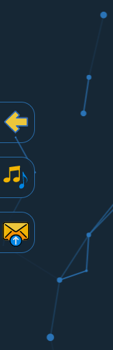

<br/>

<h3 id="left-buttons-container">2. Description of the container for buttons <a href="#left-buttons-list">⬆</a></h3>

The element of the container to which the buttons shown above are attached has appropriate styles, thanks to which the buttons inside take the right place next to each other. In turn, each button in the discussed container has the same styles, which facilitates the development process.

<br/>

The styles for the discussed solution are presented below:

```css
/* styles/components/globalLeftContainer.css file: */

#global-left-container {
  position: fixed;
  top: 0;
  left: 0%;
  width: 0px;
  height: 100%;
  transform: translateX(-50px);
  display: flex;
  flex-direction: column;
  justify-content: center;
  animation: slideInFromLeft 0.3s 2s ease-in forwards;
  z-index: 2;
}

.global-left-btn {
  position: relative;
  left: 0px;
  height: 60px;
  display: flex;
  justify-content: center;
  align-items: center;
  margin: 0 auto;
  margin-bottom: 20px;
  padding: 2px 7px 2px 0;
  border: 1px solid var(--borderColor);
  border-top-right-radius: 20px;
  border-bottom-right-radius: 20px;
  border-left: none;
  opacity: 0.9;
  z-index: 1;
}

.global-left-btn img {
  width: 40px;
  margin-left: 3px;
}

@media screen and (max-width: 1050px) {
  .global-left-btn {
    height: 50px;
    padding: 0;
    padding-right: 5px;
  }

  .global-left-btn img {
    width: 27px;
    margin-left: 3px;
  }
}
```

It also worth adding that the buttons container (with global-left-container id) is included in every html file , but the buttons with all logic are dynamically created with javascript for better logic maintenance (this will be explained with specific examples).

<br/>
<br/>

<h3 id="audio-object">3.2.4. Audio support on the site by Audio object <a href="#specific-main">⬆</a></h3>

<p id="audio-list">Table of content of this section:</p>

1. [Introdution](#audio-introduction)

2. [Description of creating an instance of the Audio object](#audio-instance)

3. [Description of the Audio object logic](#audio-logic)

<br/>

<h3 id="audio-introduction">1. Introdution <a href="#audio-list">⬆</a></h3>

The first of the additional functionalities on the website which I would like to describe is related to audio support on the website.

<br/>

Below is a visual example of turning audio on and off on the home page:


<br/>

<h3 id="audio-instance">2. Description of creating an instance of the Audio object <a href="#audio-list">⬆</a></h3>

Before I go on to the implementation of the Audio object, which is responsible for
handling the audio on the page, I would like to focus on how to create an instance of this object.

<br/>

The following is an example of creating an instance of the Audio object in sites/home.js file which is the main script for the index.html file (home page):

```js
//scripts/sites/home.js file:

new Audio({
  container: idReferences.global.leftContainer,
  trigger: idReferences.sneakPeeks.trigger,
  path: paths.mainPageIntroduction,
})
```

<br/>

And below is an example of creating an instance of the aforementioned object in sites/fluentBlog.js file (contains description of the FluentBlog project that was created ) which is the main script for the fluentBlog.html file:

```
//scripts/sites/index.js file:

new Audio({
  container: idReferences.global.leftContainer,
  path: paths.fluentBlogPageInfo,
})
```

As we can see in the two examples above, to the instance is passed the object with:

- the reference of the container (on the basis of which the appropriate DOM element is searched for, which acts as a container for the elements created in Audio object),
- the path with the audio file (the audio file containing the audio small description of a given page with background music)
- a reference to the trigger element (it is only sent in the case of the home page and on the basis of this reference the appropriate DOM element is searched for, which acts as an action trigger element, which will be described when discussing the Audio object in depth).

<br/>

<h3 id="audio-logic">3. Description of the Audio object logic <a href="#audio-list">⬆</a></h3>

<p id="audio-logic-list">To make it easier to find yourself in the description below, there is a list of topics covered:</p>

&nbsp; 3.1. [Code example of the constructor of the Audio object](#audio-code-example)

&nbsp; 3.2. [Description of the variables in the object constructor](#audio-constructor-variables)

&nbsp; 3.3. [Description of the createElements method (constructor)](#audio-createelements-method)

&nbsp; 3.4. [Description of the createComponents method (constructor)](#audio-createcomponents-method)

&nbsp; 3.5. [Description of use the appendElementsToContainerFn helper (constructor)](#audio-appendelementstocontainerfn-helper)

&nbsp; 3.6. [Description of use the triggerActionOnWindowScrollFn helper with the related toggleBtnComponent method (constructor)](#audio-triggeractiononwindowscrollfn-helper)

&nbsp; 3.7. [Description of the handleAudio method](#audio-handleaudio-method)

<br/>

<h3 id="audio-code-example">3.1. Code example of the constructor of the Audio object <a href="#audio-logic-list">⬆</a></h3>

After explaining how the instances of the Audio object are created for different pages, now I would like to present the implementation of this object below:

```js
//scripts/objects/Audio.js file:

class Audio {
  constructor({ container, trigger, path }) {
    this.play = false
    this.path = path

    this.createElements()
    this.createComponents()
    appendElementsToContainerFn({ elements: [this.btnComponent], container })

    trigger &&
      triggerActionOnWindowScrollFn({
        onWhatElement: trigger,
        cbOnEnterTriggerEl: () =>
          this.toggleBtnComponent({ toggle: toggleValue.off }),
        cbOnExitTriggerEl: () =>
          this.toggleBtnComponent({ toggle: toggleValue.on }),
        modifier: 80,
      })
  }
}
```

<br/>

<h3 id="audio-constructor-variables">3.2. Description of the variables in the object constructor <a href="#audio-logic-list">⬆</a></h3>

As we can see in the code example above, in constructor of the object we have following variables:

- this.play which assign boolean values (true/false) thanks to which it will be possible to turn the audio on and off,
- this.path which assign the passed path to a specific audio file

<br/>

<h3 id="audio-createelements-method">3.3. Description of the createElements method (constructor) <a href="#audio-logic-list">⬆</a></h3>

After assigning values to variables, the createElements method is called, the implementation of which is below:

```js
//scripts/objects/Audio.js file:

  createElements() {
    this.audio = createElementFn({
      element: elements.audio,
      src: this.path,
    })

    this.btn = createElementFn({
      element: elements.button,
      classes: [classNames.global.leftBtn],
      listeners: [{ event: events.click, cb: () => this.handleAudio() }],
    })

    this.audioImg = createElementFn({
      element: elements.img,
      src: paths.pauseImg,
    })
  }
```

As we can see above, the discussed method uses the createElementFn helper to create following elements:

- this.audio - element with a soundtrack,
- this.btn - button element that handles audio on which the listener is set to the event click that calls the handleAudio method,
- this.audioImg - element with sound icon.

<br/>

<h3 id="audio-createcomponents-method">3.4. Description of the createComponents method (constructor) <a href="#audio-logic-list">⬆</a></h3>

Next, in the constructor of discussed object, we call the createComponents method, the implementation of which is below:

```js
//scripts/objects/Audio.js file:

  createComponents() {
    this.btnComponent = appendElementsToContainerFn({
      elements: [this.audioImg],
      container: this.btn,
    })
  }
```

As we can see above, the discussed method based on previously created elements (this.audioImg and this.btn), combines them into the so-called main component (this.mainComponent) via helper appendElementsToContainer.

<br/>

<h3 id="audio-appendelementstocontainerfn-helper">3.5. Description of use the appendElementsToContainerFn helper (constructor) <a href="#audio-logic-list">⬆</a></h3>

At the end part of the constructor logic created component (this.btnComponent) are attached to the passed container using appendElementsToContainerFn helper.

<br/>

<h3 id="audio-triggeractiononwindowscrollfn-helper">3.6. Description of use the triggerActionOnWindowScrollFn helper with the related toggleBtnComponent method (constructor) <a href="#audio-logic-list">⬆</a></h3>

At the very end in the constructor logic there is a conditional call (depending on whether the trigger element reference has been sent) of the triggerActionOnWindowScrollFn helper.

<br/>

Below is an example of calling this helper along with the toggleBtnComponent method that is passed to it:

```js
//scripts/objects/Audio.js file:

    trigger &&
      triggerActionOnWindowScrollFn({
        onWhatElement: trigger,
        cbOnEnterTriggerEl: () =>
          this.toggleBtnComponent({ toggle: toggleValue.off }),
        cbOnExitTriggerEl: () => this.toggleBtnComponent({ toggle: toggleValue.on }),
        modifier: 80,
      })

    toggleBtnComponent({ toggle }) {
      setPropsFn({
        toggle,
        objs: [
          {
            elements: [this.btnComponent],
            styleProps: [
              {
                name: styleProps.names.transform,
                values: {
                  on: styleProps.values.translateX(0),
                  off: styleProps.values.translateX(-100),
                },
              },
            ],
          },
        ],
      })
  }
```

As we can see above, to this helper are passed objects with following elements:

- the trigger element,
- the toggleBtnComponent method with passing a different toggle value "on"/"off" depending on the position relative to the trigger element,
- modifier with a value of 80 (a slight change of the place where the method is called toggleBtnComponent).

<br/>

I will not discuss how this helper works here because it was done in the helpers description section.

The toggleBtnComponent method that is used in this helper uses the setPropsFn helper to set the appropriate style properties on the this.btnComponent component (depending on the value of toggle, the component either hides or shows).

<br/>

Below is a visual example of the above solution in which, when scrolled, the toggleBtnComponent method is called with a different toggle value depending on the position of the trigger:

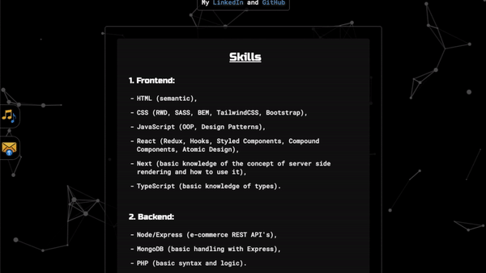

As we can see above, the sound button behaves differently to the form button due to the modifier discussed earlier (in a later section, I will explain how to create a form component using the form button shown above).

<br/>

Summarizing, thanks to this solution, when the trigger element is crossed during the page scroll, above discussed method will be called with the toggle value of "on" (styles are added thanks to which the button is hidden) and when the trigger element is leaved by scrolling, the same method is called but with toggle set to "off" (styles are added thanks to which the button is show).

<br/>

<h3 id="audio-handleaudio-method">3.7. Description of the handleAudio method <a href="#audio-logic-list">⬆</a></h3>

In the case of the created this.btn element in createElements method, we have an event listener that is set to event click, which calls the handleAudio method.

<br/>

Below is an excerpt from the createElements method that pertains to this.btn element, along with the implementation of handleAudio method:

```js
//scripts/objects/Audio.js file:

  this.btn = createElementFn({
    element: elements.button,
    classes: [classNames.global.leftBtn],
    listeners: [{ event: events.click, cb: () => this.handleAudio() }],
  })

  handleAudio() {
    this.play = !this.play
    this.play ? this.audio.play() : this.audio.pause()
    this.audioImg.src = this.play ? paths.playImg : paths.pauseImg
  }
```

As we can see above, it is a simple method that first sets the opposite value in the this.play variable (thanks to it we have the option to turn on and stop the audio) and depending on whether the mentioned value is true or false, the appropriate icon set in this.audioImg element and on this.audio element the appropriate play (turn on audio) or pause (stop audio) method is called.

<br/>
<br/>

<h3 id="curtain-object">3.2.5. A Curtain object that allows to attach components dynamically <a href="#specific-main">⬆</a></h3>

<p id="curtain-list">Table of content of this section:</p>

1. [Introdution](#curtain-introduction)

2. [Description of the Curtain object logic](#curtain-logic)

<br/>

<h3 id="curtain-introduction">1. Introdution <a href="#curtain-list">⬆</a></h3>

Before I go on to the description of the next functionality related to the creation of a form component (which is called via the next button of the left side of page), the Curtain object, which plays a key role in the process of creating a form, must be described.

The discussed object is responsible for creating the container element (curtain), to which various components can be dynamically added and removed using appropriate methods of Curtain object.

<br/>

At the beginning I would like to mention that this container element (curtain) appears in the form of a dark background with the simultaneous immobilization of the page, which can be seen in the example below when creating the form component:


Based on the example presented above, we can see that after click on the button on the left side of the main page (this solution is also available on every subpage) a form component appears (after the short animation) with the curtain simultaneously.

In fact, this form component is dynamically created when the button is clicked, and the Curtain object attaches it to itself using appropriate methods - so we can see it on the page (this process will be described in more detail based on a code example).

When closing form component via the "X" icon or by clicking a container (curtain), such a component is removed from the Curtain object and the curtain element hides without children (the curtain element is ready to attach new component).

Thanks to this solution, some components (for example form component) can exists only at the time of its use and this logic allows to dynamically display components one after another e.g. login window, advertising, popup etc. (on the website now there is only a form component but there may be other components in the future).

<br/>

<h3 id="curtain-logic">2. Description of the Curtain object logic <a href="#curtain-list">⬆</a></h3>

For a better understanding of the logic behind the solution described above, below is explanation of the operation of the Curtain object.

<p id="curtain-logic-list">To make it easier to find yourself in the description below, there is a list of topics covered:</p>

&nbsp; 2.1. [Code example of the constructor of the Curtain object](#curtain-code-example)

&nbsp; 2.2. [General description of the constructor](#curtain-constructor-general)

&nbsp; 2.3. [Description of the variables in object constructor](#curtain-constructor-variables)

&nbsp; 2.4. [Description of the createElements method (constructor)](#curtain-createelements-method)

&nbsp; 2.5. [Description of use the appendElementsToContainerFn helper (constructor)](#curtain-appendelementstocontainerfn-helper)

&nbsp; 2.6. [Description of the toggleShow method (toggle "on")](#curtain-toggleshow-on-method)

&nbsp; 2.7. [Description of the addCbsToCallOnHidden method (inside the toggleShow method with passing the toggle parameter with "on" value](#curtain-addcbstocallonhidden-method)

&nbsp; 2.8. [Description of the appendElements and the related addElToChildren method (inside the toggleShow method with passing the toggle parameter with "on" value)](#curtain-appendelements-method)

&nbsp; 2.9. [Description of the toggleBodyFreeze (inside the toggleShow method with passing the toggle parameter with "on" value)](#curtain-togglebodyfreeze-method)

&nbsp; 2.10. [Description of the toggleActive method (inside the toggleShow method with passing the toggle parameter with "on" value)](#curtain-toggleactive-method)

&nbsp; 2.11. [A visual example of adding a form component to the curtain (the effect of calling the toggleShow method with the toggle parameter set to "on")](#curtain-adding-form-component)

&nbsp; 2.12. [Description of the togglePreventHidden method (inside the toggleShow method with passing the toggle parameter with "off" value)](#curtain-togglepreventhidden-method)

&nbsp; 2.13. [Description of the callCbsOnHidden method (inside the toggleShow method with passing the toggle parameter with "off" value](#curtain-callcbsonhidden-method)

&nbsp; 2.14. [Description of the clear method with the related clearChildren and the clearCbsToCallOnHidden methods (inside the toggleShow method with passing the toggle parameter with "off" value](#curtain-clear-method)

&nbsp; 2.15. [A visual example of removing a form component from a curtain](#curtain-remove-form-component)

<br/>

<h3 id="curtain-code-example">2.1. Code example of the constructor of the Curtain object <a href="#curtain-logic-list">⬆</a></h3>

Below is an implementation of the Curtain object constructor:

```js
//scripts/objects/Curtain.js file:

class Curtain {
  constructor(container) {
    if (Curtain.instance == null) {
      Curtain.instance = this
      this.preventHidden = false
      this.cbsToCallOnHidden = []
      this.children = []

      this.createElements()
      appendElementsToContainerFn({ elements: [this.curtain], container })
    }
    return (Curtain.instance = this)
  }
}

const curtain = new Curtain(idReferences.global.mainContainer)
export default curtain
```

<br/>

<h3 id="curtain-constructor-general">2.2. General description of the constructor <a href="#curtain-logic-list">⬆</a></h3>

As we can see in the example above, in the constructor we are dealing with singleton design patter. Thanks to it, we can create only one instance of the Curtain object, which is the main source of saving various data (each time we want to create a new instance, the first one is returned (Curtain.instance = this)).

<br/>

<h3 id="curtain-constructor-variables">2.3. Description of the variables in the object constructor <a href="#curtain-logic-list">⬆</a></h3>

As we can see in the code example above in the object constructor we have following variables:

- this.preventHidden which assign boolean value (true/false) which prevents the so-called hiding the curtain,
- this.cbsToCallOnHidden which assign callbacks that were sent to the object from outside,
- this.children which assign elements to be attached to curtain.

<br/>

<h3 id="curtain-createelements-method">2.4. Description of the createElements method (constructor) <a href="#curtain-logic-list">⬆</a></h3>

Next, in the constructor logic, the createElements method is called the implementation of which is below:

```js
// scripts/objects/Curtain.js file:

  createElements() {
    this.curtain = createElementFn({
      element: elements.div,
      classes: [classNames.curtain.main],
      listeners: [
        {
          event: events.click,
          cb: () => this.toggleShow({ toggle: toggleValue.off }),
        },
      ],
    })
  }
```

As we can see, it is a simple method that creates the this.curtain element with the help of the createElementFn helper, which has the listener set to event clicks which calls the toggleShow method (method discussed later)

<br/>

<h3 id="curtain-appendelementstocontainerfn-helper">2.5. Description of use the appendElementsToContainerFn helper (constructor) <a href="#curtain-logic-list">⬆</a></h3>

At the end of the constructor logic created element (this.curtain) is attached to the passed container using appendElementsToContainerFn helper.

<br/>

<h3 id="curtain-toggleshow-on-method">2.6. Description of the toggleShow method <a href="#curtain-logic-list">⬆</a></h3>

The main method that calls the rest of the Curtain object methods is the toggleShow method, the implementation of which is shown below:

```js
//scripts/objects/Curtain.js file:

  toggleShow({ toggle, appendElements, cbsToCallOnHidden } = {}) {
    switch (toggle) {
      case toggleValue.on:
        this.addCbsToCallOnHidden({ cbs: cbsToCallOnHidden })
        this.appendElements({ elements: appendElements })
        break

      case toggleValue.off:
        if (this.preventHidden) return
        this.callCbsOnHidden()
        this.clear({ after: 200 })

        break

      default:
        break
    }

    this.toggleBodyOverflow({ toggle })
    this.toggleActive({ toggle })
  }
```

As we can see above, this is a method that takes the following arguments:

- toggle ("on"/"off"),
- appendElements (elements to be attached to the curtain),
- callbacks (to be called when the curtain hides).

<br/>

Then in this method, there may be two cases (toggle "on"/"off") where different methods are called (by switch statement) and their description is in the subsections below.

<br/>

<h3 id="curtain-addcbstocallonhidden-method">2.7. Description of the addCbsToCallOnHidden method (inside the toggleShow method with passing the toggle parameter with "on" value) <a href="#curtain-logic-list">⬆</a></h3>

In first scenario where toggleShow method is called with toggle value "on", the sent callbacks are added to the this.cbsToCallOnHidden array via the addCbsToCallOnHidden method.

<br/>

Below is a fragment of the toggleShow method in which the discussed method is called and its implementation next to it:

```js
//scripts/objects/Curtain.js file:

  this.addCbsToCallOnHidden({ cbs: cbsToCallOnHidden })

  addCbsToCallOnHidden({ cbs }) {
    cbs.map((cb) => this.cbsToCallOnHidden.push(cb))
  }
```

As we can see above, this is a simple method that iterates through adds the passed callbacks to the this.cbsToCallOnHidden array.

<br/>

<h3 id="curtain-appendelements-method">2.8. Description of the appendElements and the related addElToChildren method (inside the toggleShow method with passing the toggle parameter with "on" value) <a href="#curtain-logic-list">⬆</a></h3>

Next, in the toggleShow method (with the toggle parameter value set to "on") the appendElements method is called.

<br/>

Below is a fragment of the toggleShow method in which the discussed method is called and its implementation next to it:

```js
//scripts/objects/Curtain.js file:

  this.appendElements({ elements: appendElements })

  appendElements({ elements }) {
    elements.map((element) => {
      this.curtain.appendChild(element)
      this.addElToChildren({ element })
    })
  }
```

<br/>

As we can see above, it is also a simple method which, during the interaction, attaches passed elements to the previously created this.curtain element and calls the addElToChildren method, the implementation of which is shown below (scripts/objects/Curtain.js):

```
  addElToChildren({ element }) {
    this.children.push(element)
  }
```

As we can see above, this method is only responsible for adding the passed element to the array named this.children (to be able to refer to these elements later).

<br/>

<h3 id="curtain-togglebodyfreeze-method">2.9. Description of the toggleBodyFreeze (inside the toggleShow method with passing the toggle parameter with "on" value) <a href="#curtain-logic-list">⬆</a></h3>

In the penultimate place in method toggleShow (with the toggle parameter value set to "on"), method toggleBodyFreeze is called.

<br/>

Below is a fragment of the toggleShow method in which the discussed method is called and its implementation next to it:

```js
//scripts/objects/Curtain.js file:

  this.toggleBodyFreeze({ toggle })

  toggleBodyFreeze({ toggle }) {
    setPropsFn({
      toggle,
      objs: [
        {
          elements: [document.body],
          styleProps: [
            {
              name: styleProps.names.overflow,
              values: {
                on: styleProps.values.hidden,
                off: styleProps.values.auto,
              },
            },
          ],
        },
      ],
    })
  }
```

As we can see in the example above, this method uses the setPropsFn helper (implementation is here scripts/helpers/setPropsFn.js), thanks to which it sets the appropriate styles depends on passed toggle value on the body element (in our scenario the value of the toggle parameter is "on" so the overflow property of the body element is set to hidden, which causes the screen to freeze).

<br/>

<h3 id="curtain-toggleactive-method">2.10. Description of the toggleActive method (inside the toggleShow method with passing the toggle parameter with "on" value) <a href="#curtain-logic-list">⬆</a></h3>

The last method that is called in toggleShow (with the toggle parameter value set to "on") is toggleActive method.

<br/>

Below is a fragment of the toggleShow method in which the discussed method is called and its implementation next to it:

```js
//scripts/objects/Curtain.js file:

  toggleActive({ toggle }) {
    setPropsFn({
      toggle,
      objs: [
        {
          elements: [this.curtain],
          styleProps: [
            {
              name: styleProps.names.visibility,
              values: {
                on: styleProps.values.visible,
                off: styleProps.values.hidden,
              },
            },
            {
              name: styleProps.names.opacity,
              values: {
                on: 1,
                off: 0,
              },
            },
          ],
        },
      ],
    })
  }
```

As we can see above, the toggleActive method through the helper setPropsFn, similar to the previous method, sets the appropriate styles (visibility and opacity) thanks to which we have a visible dark curtain (in scenario when we have toggle value "on").

<br/>

<h3 id="curtain-adding-form-component">2.11. A visual example of adding a form component to the curtain (the effect of calling the toggleShow method with the toggle parameter set to "on") <a href="#curtain-logic-list">⬆</a></h3>

Below is a visual example of adding a form component to a curtain by pressing the button with the form icon (this process will be discussed in the next section):


The above operation is possible by calling the toggleShow method, to which the toggle "on" value is passed.

<br/>

<h3 id="curtain-togglepreventhidden-method">2.12. Description of the togglePreventHidden method (inside the toggleShow method with passing the toggle parameter with "off" value) <a href="#curtain-logic-list">⬆</a></h3>

In order to better understand this and the next description (with the toggle parameter value set to "off"), the toggleShow method has been quoted below once again to make it easier to refer to the described logic below:

```js
//scripts/objects/Curtain.js file:

  toggleShow({ toggle, appendElements, cbsToCallOnHidden } = {}) {
    switch (toggle) {
      case toggleValue.on:
        this.addCbsToCallOnHidden({ cbs: cbsToCallOnHidden })
        this.appendElements({ elements: appendElements })
        break

      case toggleValue.off:
        if (this.preventHidden) return
        this.callCbsOnHidden()
        this.clear({ after: 200 })

        break

      default:
        break
    }

    this.toggleBodyFreeze({ toggle })
    this.toggleActive({ toggle })
  }
```

In the case when toggleShow method is called with toggle value "off", at the beginning the condition is checked whether the value of this.preventHidden is true (this value is set by the simply togglePreventHidden method). If it is true, the whole function is return (this option is set when the form data is sent to the backend so that the component cannot be removed).

<br/>

Below is an example of an implementation of the togglePreventHidden method and an example of calling it in a Form object in the handleFormSubmit method:

```js
//scripts/objects/Form.js file:

  curtain.togglePreventHidden({ toggle: toggleValue.on })

  togglePreventHidden({ toggle }) {
    this.preventHidden = toggle === toggleValue.on ? true : false
  }
```

As we can see, thanks to this method, we can set the variable this.preventHidden depending on the value of the passed toggle parameter (in this case we have passed the value of the toggle parameter "on").

<br/>

Below is a visual example that shows the inability to close the form component when sending data to the server:

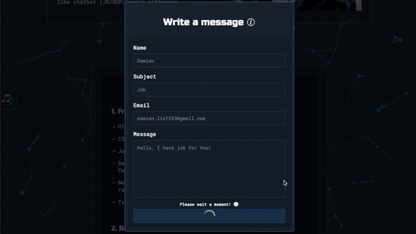

<br/>

<h3 id="curtain-callcbsonhidden-method">2.13. Description of the callCbsOnHidden method (inside the toggleShow method with passing the toggle parameter with "off" value) <a href="#curtain-logic-list">⬆</a></h3>

If the value of this.preventHidden is false previously passed callbacks (sent when toggle value was "on") are called via callCbsOnHidden method.

<br/>

Below is a fragment of the toggleShow method in which the discussed method is called and its implementation next to it:

```js
//scripts/objects/Curtain.js file:

  this.callCbsOnHidden()

  callCbsOnHidden() {
    this.cbsToCallOnHidden.map((cb) => cb())
  }
```

As we can see above, it is a simple method that calls functions (callbacks) while iterating through the array.

<br/>

<h3 id="curtain-clear-method">2.14. Description of the clear method with the related clearChildren and the clearCbsToCallOnHidden methods (inside the toggleShow method with passing the toggle parameter with "off" value) <a href="#curtain-logic-list">⬆</a></h3>

The next method that is called in sequence is clear method.

<br/>

Below is a fragment of the toggleShow method in which the discussed method is called and its implementation with related methods next to it:

```js
//scripts/objects/Curtain.js file:

  this.clear({ after: 200 })

  clearCbsToCallOnHidden() {
    this.cbsToCallOnHidden = []
  }

  clearChildren() {
    this.children = []
  }

  clear({ after }) {
    this.clearCbsToCallOnHidden()
    setTimeout(() => {
      this.children.map((child) => child.remove())
      this.clearChildren()
    }, after)
  }
```

As we can see above, this method is called with the delay argument of 200 (the time after which individual curtain elements are to be removed - it was introduced so that the user does not feel the sudden removal of elements).

<br/>

In this method, the following methods are called:

- the clearCbsToCallOnHidden method, which sets the default empty array of this.cbsToCallOnHidden (clearing the array),
- the setTimeout function, which after a certain time, calls function with an iteration on the array with curtain children, during which this children are removed from the curtain structure,
- clearChildren method, which sets the default empty array of this.children (clearing the array).

<br/>

In this section I will add that at the very end of toggleShow method (in the case of toggle is "off"), the same methods that I described earlier (toggleBodyOverflow, toggleActive) are called, but in the opposite way (therefore I will not quote them further).

<br/>

<h3 id="curtain-remove-form-component">2.15. A visual example of removing a form component from a curtain <a href="#curtain-logic-list">⬆</a></h3>

Below is a visual example of removing the component form by clicking on the curtain and by clicking on the X button of the form component (in both cases the toggleShow method is called with the toggle parameter set to "off" - for the X button of the form component, this process will be discussed in the next section):

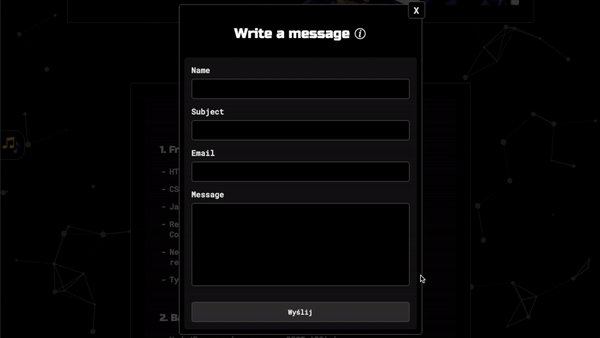

<br/>
<br/>

<h3 id="form-object">3.2.6. Dynamic form creation by Form object <a href="#specific-main">⬆</a></h3>

<p id="form-list">Table of content of this section:</p>

1. [Introdution](#form-introduction)

2. [Description of creating an instance of the Form object](#form-instance)

3. [Description of the Form object logic](#form-logic)

<br/>

<h3 id="form-introduction">1. Introdution <a href="#form-list">⬆</a></h3>

In this section, I would like to focus on explaining the creation of the form component along with its entire logic of operation along with sending data to the server (handled by my backend application [Emails Handler](https://github.com/damian-lis/Emails-handler)).

<br/>

Below is one more visual example of the logic of form component which is create by a Form object(an example also used when discussing the Curtain object):


<br/>

<h3 id="form-instance">2. Description of creating an instance of the Form object <a href="#form-list">⬆</a></h3>

Before I go on to the implementation of the Form object, which is responsible for handling the form on the page, I would like to focus on how to create an instance of this object.

<br/>

The following is an example of creating an instance of the Form object in sites/home.js file which is the main script for the index.html file (home page):

```js
//scripts/sites/index.js file:

new Form({
  container: idReferences.global.leftContainer,
  trigger: idReferences.sneakPeeks.trigger,
  data: formFieldsInfo,
})
```

As we can see in above code example, we pass to the instance of the Form object the following parameters:

- container which is a a reference to the container element (regarding the form button),
- trigger which is a reference to the trigger element that triggers the action (similar to Audio object),
- data which is a set of data on the basis of which will be created form fields.

<br/>

<h3 id="form-logic">3. Description of the Form object logic <a href="#form-list">⬆</a></h3>

To make it easier to find yourself in the description below, there is a list of topics covered:

<br/>

<p id="form-button-creating-part">FORM BUTTON CREATING PART:</p>

&nbsp; 3.1. [Code example of the constructor of the Form object](#form-code-example)

&nbsp; 3.2. [Description of the variables in object constructor](#form-constructor-variables)

&nbsp; 3.3. [Description of the createInitialElements method (constructor)](#form-createinitialelements-method)

&nbsp; 3.4. [Description of the createInitialComponents method (constructor)](#form-createinitialcomponents-method)

&nbsp; 3.5. [Description of use the appendElementsToContainerFn helper (constructor)](#form-appendelementstocontainerfn-helper)

&nbsp; 3.6. [Description of use the triggerActionOnWindowScrollFn helper with the related toggleBtnComponent method (constructor)](#form-triggeractiononwindowscrollfn-helper)

<br/>

<p id="form-component-creating-part">FORM COMPONENT CREATING PART:</p>

&nbsp; 3.7. [Description of the handleMainComponentCreate method](#form-handlemaincomponentcreate-method)

&nbsp; 3.8 [Description of the toggleBtnComponent method (toggle "off") (inside the handleMainComponentCreate method)](#form-togglebtncomponent-off-method)

&nbsp; 3.9 [Description of the createMainElements method (inside the handleMainComponentCreate method)](#form-createmainelements-method)

&nbsp; 3.10 [Description of the data/informations/formField file which consist the data passed to the Form object which is closely related to the createMainElements method (inside the handleMainComponentCreate method)](#form-field-data)

&nbsp; 3.11 [Description of the createFormFieldElements method which is closely related to the createMainElements method (inside the handleMainComponentCreate method)](#form-createformfieldelements-method)

&nbsp; 3.12 [Description of the createMainComponents method (inside the handleMainComponentCreate method)](#form-createmaincomponents-method)

&nbsp; 3.13 [Description of the toggleShow Curtain object method (the last method inside the handleMainComponentCreate method)](#form-toggleshow-curtain-method)

<br/>

<p id="form-inputs-logic-part">FORM INPUTS LOGIC PART:</p>

&nbsp; 3.14 [Description of the inputs (text, email and textarea) logic with the handleFormTextInputTyping and handleFormTextInputFocus methods](#form-inputs-logic)

&nbsp; 3.15 [Description of the inputs (text, email and textarea) notifications logic with the handleFormTextInputNotificationClick method](#form-notifications-logic)

<br/>

<p id="form-submit-logic-part">FORM SUBMIT LOGIC PART:</p>

&nbsp; 3.16 [Description of the form submit logic with the handleFormSubmit method](#form-submit-logic)

&nbsp; 3.17. [Description of the emailValidate method (inside the handleFormSubmit method)](#form-emailvalidate-method)

&nbsp; 3.18. [Description of the findEmptyFormTextInputs method (inside the handleFormSubmit method)](#form-findemptyformtextinputs-method)

&nbsp; 3.19. [Description of the toggleFormTextInputsNotification method (toggle "on") (inside the handleFormSubmit method)](#form-toggleformtextinputsnotification-on-method)

&nbsp; 3.20. [Description of the disableFormInputs method (inside the handleFormSubmit method)](#form-disableforminputs-method)

&nbsp; 3.21. [Description of the toggleDeleteBtnComponent method (toggle "off") (inside the handleFormSubmit method)](#form-toggledeletebtncomponent-off-method)

&nbsp; 3.22. [Description of the toggleSpinnerComponent method (toggle "on") (inside the handleFormSubmit method)](#form-togglespinnercomponent-on-method)

&nbsp; 3.23. [Description of the toggleFormSubmitInputlNotifications method (toggle "on") (inside the handleFormSubmit method)](#form-toggleformsubmitinputnotifications-on-method)

&nbsp; 3.24. [Description of the togglePreventHidden method (toggle "on") of Curtain object (inside the handleFormSubmit method)](#form-togglepreventhidden-on-method)

&nbsp; 3.25. [Description of handleEmailSent method (inside the handleFormSubmit method)](#form-handleemailsent-method)

&nbsp; 3.26. [Description of the resetFormTextInputsValue method (inside the handleFormSubmit method)](#form-resetformtextinputsvalue-method)

&nbsp; 3.27. [Description of the toggleSpinnerComponent method (toggle "off") (inside the handleFormSubmit method)](#form-togglespinnercomponent-off-method)

&nbsp; 3.28. [Description of the toggleFormSubmitInputlNotifications method (toggle "off") (inside the handleFormSubmit method)](#form-toggleformsubmitinputnotifications-off-method)

&nbsp; 3.29. [Description of the hideTitleInfo method (inside the handleFormSubmit method)](#form-hidetitleinfo-method)

&nbsp; 3.30. [Description of the hideFormComponent method (inside the handleFormSubmit method)](#form-hideformcomponent-method)

&nbsp; 3.31. [Description of the replaceTitleText method (inside the handleFormSubmit method)](#form-replacetitletext-method)

&nbsp; 3.32. [Description of the reduceMainComponentHeight method (inside the handleFormSubmit method)](#form-reducemaincomponentheight-method)

&nbsp; 3.33. [Description of the moveTitleComponent method (inside the handleFormSubmit method)](#form-movetitlecomponent-method)

&nbsp; 3.34. [Description of the revealTitleWhisper method with the visual animation example (inside the handleFormSubmit method)](#form-revealtitlewhisper-method)

&nbsp; 3.35. [Description of the setDelayFn helper (inside the handleFormSubmit method)](#form-setdelayfn-helper)

<br/>

<p id="form-delete-logic-part">FORM DELETE LOGIC PART:</p>

&nbsp; 3.36. [Description of the setSelfDestructEventToMainComponent method (inside the handleFormSubmit method)](#form-setselfdesctructeventtomaincomponent-method)

&nbsp; 3.37. [Description of the togglePreventHidden method (toggle "off") of Curtain object (inside the handleFormSubmit method)](#form-togglepreventhidden-off-method)

&nbsp; 3.38. [Description of delete a form component through the this.btnDelete element](#form-delete)

<br/>

### FORM BUTTON CREATING PART:

<h3 id="form-code-example">3.1. Code example of the constructor of the Form object <a href="#form-button-creating-part">⬆</a></h3>

Moving on to the logic of the discussed object, first I would like to focus on the constructor of the object, which is very simple and is presented below:

```js
//scripts/objects/Form.js file:

class Form {
  constructor({ container, trigger, data }) {
    this.formFieldsInfo = data
    this.notificationTimeouts = []
    this.dataFromUser = {}

    this.createInitialElements()
    this.createInitialComponents()
    appendElementsToContainerFn({ elements: [this.btnComponent], container })

    trigger &&
      triggerActionOnWindowScrollFn({
        onWhatElement: trigger,
        cbOnEnterTriggerEl: () =>
          this.toggleBtnComponent({ toggle: toggleValue.off }),
        cbOnExitTriggerEl: () =>
          this.toggleBtnComponent({ toggle: toggleValue.on }),
      })
  }
}
```

<br/>

<h3 id="form-constructor-variables">3.2. Description of the variables in the object constructor <a href="#form-button-creating-part">⬆</a></h3>

As we can see in the code example above we have following variables in the constructor:

- this.formFieldsInfo which is a set of data on the basis of which will be created form fields,
- which is an array to which the setTimoeut id will be added regarding notifications(default is empty),
- this.dataFromUser which is an object to which data written via the form will be dynamically added.

<br/>

<h3 id="form-createinitialelements-method">3.3. Description of the createInitialElements method (constructor) <a href="#form-button-creating-part">⬆</a></h3>

Next, after variables in the constructor, the createInitialElements method is called, the implementation of which is below:

```js
//scripts/objects/Form.js file:

  createInitialElements() {
    this.btn = createElementFn({
      element: elements.button,
      classes: [classNames.global.leftBtn],
      listeners: [
        {
          event: events.click,
          cb: () => this.handleMainComponentCreate(),
        },
      ],
    })

    this.emailImg = createElementFn({
      element: elements.img,
      classes: [classNames.utilities.m.t(5)],
      src: paths.emailImg,
    })
  }
```

As we can see in the example above, the createInitialElements method has simple logic in which creates button elements such as this.btn and this.emailImg (form icon) through the createElementFn helper.

It should be added here that the this.btn element has a listener that calls the handleMainComponentCreate method on the event click, which is responsible for creating the entire form component (this process will be explained later).

<br/>

<h3 id="form-createinitialcomponents-method">3.4. Description of the createInitialComponents method (constructor) <a href="#form-button-creating-part">⬆</a></h3>

Going further in the logic of the discussed object constructor, we have a call the createInitialComponents method, which, based on previously created elements (this.btn and this.emailImg).

<br/>

Below is an example of this method:

```js
//scripts/objects/Form.js file:

  createInitialComponents() {
    this.btnComponent = appendElementsToContainerFn({
      elements: [this.emailImg],
      container: this.btn,
    })
  }
```

As we can see in the code example above this method combines this.emailImg with this.btn via the appendElementsToContainerFn helper to create this.btnComponent.

<br/>

<h3 id="form-appendelementstocontainerfn-helper">3.5. Description of use the appendElementsToContainerFn helper (constructor) <a href="#form-button-creating-part">⬆</a></h3>

In the next part the previously created this.button Component is attached to the passed container to Form object by appendElementsToContainerFn helper.

<br/>

<h3 id="form-triggeractiononwindowscrollfn-helper">3.6. Description of use the triggerActionOnWindowScrollFn helper with the related toggleBtnComponent method (constructor) <a href="#form-button-creating-part">⬆</a></h3>

At the very end in the constructor logic there is a conditional call (depending on whether the trigger element reference has been sent) of the triggerActionOnWindowScrollFn helper.

<br/>

Below is an example of calling this helper along with the toggleBtnComponent method that is passed to it:

```js
//scripts/objects/Form.js file:

    trigger &&
      triggerActionOnWindowScrollFn({
        onWhatElement: trigger,
        cbOnEnterTriggerEl: () =>
          this.toggleBtnComponent({ toggle: toggleValue.off }),
        cbOnExitTriggerEl: () => this.toggleBtnComponent({ toggle: toggleValue.on }),
      })

    toggleBtnComponent({ toggle }) {
      setPropsFn({
        toggle,
        objs: [
          {
            elements: [this.btnComponent],
            styleProps: [
              {
                name: styleProps.names.transform,
                values: {
                  on: styleProps.values.translateX(0),
                  off: styleProps.values.translateX(-100),
                },
              },
            ],
          },
        ],
      })
    }
```

As we can see above, to this helper are passed following arguments:

- the trigger element (element that triggers the action of appearing or hiding the form button),
- the toggleBtnComponent method with passing a different toggle value "on"/"off" depending on the position relative to the trigger element.

I will not discuss how this helper works here because it was done in the helpers description section.

The toggleBtnComponent method that is used in this helper uses the setPropsFn helper to set the appropriate style properties on the this.btnComponent component (depending on the value of toggle, the component either hides or shows).

<br/>

Below is a visual example of the above solution in which, when scrolled, the toggleBtnComponent method is called with a different toggle value depending on the position of the trigger:


Summarizing, thanks to this solution, when the trigger element is crossed during the page scroll, above discussed method will be called with the toggle value of "on" (styles are added thanks to which the button is hidden) and when the trigger element is leaved by scrolling, the same method is called but with toggle set to "off" (styles are added thanks to which the button is show).

<br/>

### FORM COMPONENT CREATING PART:

<h3 id="form-handlemaincomponentcreate-method">3.7. Description of the handleMainComponentCreate method <a href="#form-component-creating-part">⬆</a></h3>

Now I would like to focus on explaining the handleMainComponentCreate method, which, as I mentioned before, is called via event click on the button with the form icon.

<br/>

Below is an example where this.btn element (which occurs in the createInitialElements method§) is compiled together with the handleMainComponentCreatem method which it calls:

```js
//scripts/objects/Form.js file:

  this.btn = createElementFn({
    element: elements.button,
    classes: [classNames.global.leftBtn],
    listeners: [
      {
        event: events.click,
        cb: () => this.handleMainComponentCreate(),
      },
    ],
  })

  handleMainComponentCreate() {
    this.toggleBtnComponent({ toggle: toggleValue.off })
    this.createMainElements()
    this.createMainComponents()
    curtain.toggleShow({
      toggle: toggleValue.on,
      appendElements: [this.mainComponent],
      cbsToCallOnHidden: [
        () => {
          this.toggleBtnComponent({ toggle: toggleValue.on })
          this.resetFormTextInputsValue()
          this.resetDataFromUser()
        },
      ],
    })
  }
```

As we can see above, this.btn, when clicked, calls the x method, which includes several other methods, which will be described below .

<br/>

<h3 id="form-togglebtncomponent-off-method">3.8 Description of the toggleBtnComponent method (toggle "off") (inside the handleMainComponentCreate method) <a href="#form-component-creating-part">⬆</a></h3>

First, the toggleBtnComponent method is called with passing the toggle argument with "off" value. This method has already been introduced when discussing the trigger helper, so I will just mention that thanks to it and the toggle argument that is "off", the form button on the left is hidden.

<br/>

<h3 id="form-createmainelements-method">3.9 Description of the createMainElements method (inside the handleMainComponentCreate method) <a href="#form-component-creating-part">⬆</a></h3>

Going forward, we have the createMainElements method which is responsible for creating form component elements.

<br/>

Below is an implementation of this method:

```js
//scripts/objects/Form.js file:

  createMainElements() {
    this.mainContainer = createElementFn({
      element: elements.div,
      classes: [classNames.form.mainContainer],
      listeners: [{ event: events.click, cb: (e) => e.stopPropagation() }],
    })

    this.mainContainerInner = createElementFn({
      element: elements.div,
      classes: [classNames.form.mainContainerInner],
    })

    this.btnDeleteContainer = createElementFn({
      element: elements.div,
      classes: [classNames.form.btnDeleteContainer],
    })

    this.btnDelete = createElementFn({
      element: elements.button,
      classes: [classNames.form.btnDelete],
      textContent: 'X',
      listeners: [
        {
          event: events.click,
          cb: () => curtain.toggleShow({ toggle: toggleValue.off }),
        },
      ],
    })

    this.titleContainer = createElementFn({
      element: elements.div,
      classes: [classNames.form.titleContainer],
    })

    this.title = createElementFn({
      element: elements.h(3),
      classes: [classNames.form.title],
      innerHTML: info.writeMessage,
    })

    this.whisper = createElementFn({
      element: elements.p,
      classes: [classNames.form.whisper],
      innerHTML: info.clickAnywhereToClose,
    })

    this.infoContainer = createElementFn({
      element: elements.div,
      classes: [classNames.form.infoContainer],
    })

    this.infoIcon = createElementFn({
      element: elements.img,
      classes: [classNames.form.infoIcon],
      src: paths.infoImg,
    })

    this.infoMessage = createElementFn({
      element: elements.p,
      classes: [classNames.form.infoMessage],
      innerHTML: info.emailSendingDelay,
    })

    this.formContainer = createElementFn({
      element: elements.div,
      classes: [classNames.form.container],
    })

    this.form = createElementFn({
      element: elements.form,
      classes: [classNames.form.main],
      noValidate: true,
      listeners: [
        { event: events.submit, cb: (e) => this.handleFormSubmit(e) },
      ],
    })

    this.formFields = this.formFieldsInfo.map((formFieldInfo) =>
      createElementFn({
        element: elements.div,
        classes: [
          classNames.form.field,
          `${classNames.form.field}-${formFieldInfo.name}`,
        ],
      })
    )

    this.formFieldsElements = this.formFieldsInfo.map((formFieldInfo) =>
      this.createFormFieldElements({ data: formFieldInfo })
    )

    this.formSubmitInput = (() => {
      let submitInput
      this.formFieldsElements.map((formFieldElements) => {
        if (formFieldElements.input.type === common.submit)
          submitInput = formFieldElements.input
      })
      return submitInput
    })()

    this.formTextInputs = (() => {
      let textInputs = []
      this.formFieldsElements.map(
        (formFieldElements) =>
          formFieldElements.input.type !== common.submit &&
          textInputs.push(formFieldElements.input)
      )
      return textInputs
    })()

    this.formEmailInput = (() => {
      let emailInput
      this.formTextInputs.map((input) => {
        if (common.email === input.id) {
          emailInput = input
        }
      })
      return emailInput
    })()

    this.formSpinnerContainer = createElementFn({
      element: elements.div,
      classes: [classNames.form.spinnerContainer],
    })

    this.formSpinner = createElementFn({
      element: elements.div,
      classes: [classNames.form.spinner],
    })
  }
```

As we can see, it is a simple method, but quite extensive due to the number of elements necessary to create the form component.

<br/>

Below I will try to briefly describe the most important elements of form component (all methods which are triggered by events on the following elements will be described later):

- this.deleteBtn - element responsible for removing the form component by calling the curtain.toggleShow (Curtain object method )on click,
- this.form - the main element of the form component, which, thanks to the this.handleFormSubmit method on event submit, sends the appropriate data collected through the appropriate inputs (I will describe them in a moment),
- this.formFields - an array of so-called field form (containers for this.formFieldsElements), which are created by iterating over an array of objects (this.formFieldsInfo) containing information about form field elements (this data will be explained in the next subsection),
- this.formFieldsElements - an array of objects that contain the elements of each form field which are created during the same process as above but calling the createFormFieldElements method on each iteration over an array of objects of data (this.formFieldsInfo),
- this.formSubmitInput - an input element of the submit type, which was separated on the basis of previously created form fields elements (this.formFieldsElements),
- this.formTextInputs - an array of input elements of the text type, which was separated on the basis of previously created form fields elements (this.formFieldsElements),
- this.formEmailInput - the same situation as in the above cases only for the input element of the email type,
- this.formSpinner - element that is responsible for the animation of the spinner when sending the form data to the server.

<br/>

<h3 id="form-field-data">3.10 Description of the data/informations/formField file which consist the data passed to the Form object which is closely related to the createMainElements method (inside the handleMainComponentCreate method) <a href="#form-component-creating-part">⬆</a></h3>

Before I go over to the createFormFieldElements methods, I would like to mention a few words about the data passed to the Form object (assigned to this.formFieldsInfo variable) on the basis of which form field elements are created and form fields (containers for form field elements).

<br/>

Below is an example of data regarding form fields elements that are passed to the Form object:

```js
//data/informations/formFields file:

import { common } from '/data/global/names.js'

export default [
  {
    label: common.Name,
    type: common.text,
    name: common.name,
    notifications: ['name is required 😡'],
  },
  {
    label: common.Subject,
    type: common.text,
    name: common.subject,
    notifications: ['subject is required 😡'],
  },
  {
    label: common.Email,
    type: common.email,
    name: common.email,
    notifications: ['email is required 😡', 'invalid email 😡'],
  },
  {
    label: common.Message,
    type: common.textarea,
    name: common.message,
    notifications: ['message is required 😡'],
  },
  {
    type: common.submit,
    value: common.Send,
    name: common.submit,
    notifications: [
      'Please wait a moment! 🕐',
      'literally a moment! 🛩',
      'almost, almost! 🚀',
    ],
  },
]
```

As we can see above, this file contains an array with objects that contain some information, on the basis of which individual elements of form fields will be created during iteration over an array (I will describe this process in detail in a moment).

<br/>

<h3 id="form-createformfieldelements-method">3.11 Description of the createFormFieldElements method which is closely related to the createMainElements method (inside the handleMainComponentCreate method) <a href="#form-component-creating-part">⬆</a></h3>

In this subsection I would like to move on to discuss the logic of the createFormFieldElements method which is responsible for creating individual form fields elements based on the passed data during iteration.

<br/>

This method is presented below together with the this.formFieldsElements variable, in which it is called (part of createMainElements method):

```js
//scripts/objects/Form.js file:

    this.formFieldsElements = this.formFieldsInfo.map((formFieldInfo) =>
      this.createFormFieldElements({ data: formFieldInfo })
    )

    createFormFieldElements({
        data: { label, type, name, value, notifications },
      }) {
        let lab, input

        switch (type) {
          case common.submit:
            input = createElementFn({
              element: elements.input,
              type,
              name,
              id: name,
              value,
            })
            break

          default:
            lab = createElementFn({
              element: elements.label,
              textContent: label,
              htmlFor: name,
            })
            input = createElementFn({
              element:
                type === elements.textarea ? elements.textarea : elements.input,
              type,
              name,
              id: name,
              listeners: [
                {
                  event: events.input,
                  cb: (e) => {
                    this.handleFormTextInputTyping({ input: e.target, name })
                  },
                },
                {
                  event: events.focus,
                  cb: (e) => this.handleFormTextInputFocus({ input: e.target }),
                },
              ],
            })
            break
        }

        const notificationEls = notifications.map((notificationEl) =>
          createElementFn({
            element: elements.span,
            attributes: [{ name: common.fieldname, value: name }],
            classes: [
              type === common.submit
                ? classNames.form.fieldSubmitNotification
                : classNames.form.fieldInputNotification,
            ],
            innerHTML: notificationEl,
            listeners: [
              {
                event: events.click,
                cb: (e) => {
                  type !== common.submit &&
                    this.handleFormTextInputNotificationClick({ input: e.target })
                },
              },
            ],
          })
        )

        return lab ? { lab, input, notificationEls } : { input, notificationEls }
      }
```

As we can see in the example above, an array is returned to the this.formFieldElements variable via the map method during the interaction on the this.formFieldsInfo array and calling createFormFieldElements method (to which a single object of the this.formFieldsInfo array is passed)

The called createFormFieldElements method contains switch statement constructions thanks to which we can easily refer to individual sent elements (as we can see, the object passed to the method is destructurized so that it is easier to refer to its elements).

In the case of the passed object containing the submit type, input of type submit is created, which is responsible for sending the entered data to the form to the server. Due to the fact that this type of input does not have a label element, this stage is skipped (it is not needed) and at the very end a notificationEl element is created, which is responsible for displaying appropriate notifications when submitting the form (its operation will be explained later).

<br/>

Next, when another type of object is passed to the discussed method, e.g. text, email, textarea,
the following elements are created:

- an imput element which is responsible for entering data into the form,
- a label element which informs about the type of data that should be entered into the input element
- a notificationEls array which consistnotifications which are shown to the user when he fails to fill in a given field of the form or when he gives an incorrect e-mail (this notificationEl element behaves differently than for an input of type submit - description will be explained later).

<br/>

It should be added that in the case of an object of the textarea type, instead of the input element, a textarea element is created, which makes it easier to enter longer messages (this element has also been assigned to the input variable to make it easier to manage the code).

(all the methods in the elements outlined above will be explained later)

<br/>

<h3 id="form-createmaincomponents-method">3.12 Description of the createMainComponents method (inside the handleMainComponentCreate method) <a href="#form-component-creating-part">⬆</a></h3>

Next, in the handleMainComponentCreate method, we call the createMainComponents method, which, based on previously created elements by createMainElements method and combines them into the so-called components.

<br/>

Below is an example of this method:

```js
//scripts/objects/Form.js file:

createMainComponents() {
    this.formSpinnerComponent = appendElementsToContainerFn({
      elements: [this.formSpinner],
      container: this.formSpinnerContainer,
    })

    this.formFieldComponents = this.formFields.map((field, index) => {
      const { lab, input, notificationEls } = Object.entries(
        this.formFieldsElements
      )[index][1]

      lab
        ? appendElementsToContainerFn({
            elements: [lab, input, notificationEls],
            container: field,
          })
        : appendElementsToContainerFn({
            elements: [input, ...notificationEls, this.formSpinnerComponent],
            container: field,
          })

      return field
    })

    this.formComponent = appendElementsToContainerFn({
      elements: this.formFieldComponents,
      container: this.form,
    })

    this.formMainComponent = appendElementsToContainerFn({
      elements: [this.formComponent],
      container: this.formContainer,
    })

    this.infoComponent = appendElementsToContainerFn({
      elements: [this.infoIcon, this.infoMessage],
      container: this.infoContainer,
    })

    this.titleComponent = appendElementsToContainerFn({
      elements: [this.title, this.whisper, this.infoComponent],
      container: this.titleContainer,
    })

    this.mainComponentInner = appendElementsToContainerFn({
      elements: [this.titleComponent, this.formMainComponent],
      container: this.mainContainerInner,
    })

    this.btnDeleteComponent = appendElementsToContainerFn({
      elements: [this.btnDelete],
      container: this.btnDeleteContainer,
    })

    this.mainComponent = appendElementsToContainerFn({
      elements: [this.btnDeleteComponent, this.mainComponentInner],
      container: this.mainContainer,
    })
  }
```

As we can see above, it is a simple method that combines individual previously created elements into components by appendElementsToContaierFn helper, which at the end combine into the so-called main component (this.mainComponent).

<br/>

Below is an visual example of the form component created:


<br/>

<h3 id="form-toggleshow-curtain-method">3.13 Description of the toggleShow Curtain object method (the last method inside the handleMainComponentCreate method) <a href="#form-component-creating-part">⬆</a></h3>

The last method that is called in the handleMainComponentCreate method is the toggleShow method of the Curtain object, which I will not describe in detail (this was done at the stage of discussing the Curtain object),I will just show how and with what arguments it is called.

<br/>

The following is an excerpt from the handleMainComponentCreate method with the called toggleShow method of the Curtain object:

```js
//scripts/objects/Form.js file:

curtain.toggleShow({
  toggle: toggleValue.on,
  appendElements: [this.mainComponent],
  cbsToCallOnHidden: [
    () => {
      this.toggleBtnComponent({ toggle: toggleValue.on })
      this.resetFormTextInputsValue()
      this.resetDataFromUser()
    },
  ],
})
```

As we can see in the above code example, the toggleShow method is called with:

- toggle parameter with "on" value,
- this.mainComponent element to join,
- with a callback that calls 3 methods : toggleBtnComponent, resetFormTextInputsValue,resetDataFromUser (this methods will be explained later).

<br/>

### FORM INPUTS LOGIC PART:

<h3 id="form-inputs-logic">3.14 Description of the inputs (text, email and textarea) logic with the handleFormTextInputTyping and the handleFormTextInputFocus methods <a href="#form-inputs-logic-part">⬆</a></h3>

Now that we have the forms component created, I would like to move on to describing the logic that is present in it. First of all, I would like to focus on the logic of individual inputs in the form.

<br/>

The first four inputs of the form with types: 2x text, email and textarea, have the same logic as shown in the fragment of the createFormFieldElements method in which these inputs are created (here we omit the input type submit):

```js
//scripts/objects/Form.js file:

input = createElementFn({
  element: type === elements.textarea ? elements.textarea : elements.input,
  type,
  name,
  id: name,
  listeners: [
    {
      event: events.input,
      cb: (e) => {
        this.handleFormTextInputTyping({ input: e.target, name })
      },
    },
    {
      event: events.focus,
      cb: (e) => this.handleFormTextInputFocus({ input: e.target }),
    },
  ],
})
```

As we can see above, two events are set on the input element:

- input which calls the handleFormTextInputTyping method to which we pass the given input and its name,
- focus which calls the handleFormTextInputFocus method to which we pass the given input.

</br>

The handleFormTextInputTyping method that is called on event input is shown below:

```js
//scripts/objects/Form.js file:

  handleFormTextInputTyping({ input, name }) {
    this.dataFromUser[name] = input.value
    const isInputNotificationVisible = this.checkFormTextInputNotificationVisibility(
      { input }
    )
    isInputNotificationVisible &&
      this.toggleFormTextInputsNotification({
        toggle: toggleValue.off,
        inputs: [input],
      })
  }
```

As we can see above, it is a method that first dynamically adds the value entered into the input field to the this.dataFromUser object (which is assigned to the name of this input).

<br/>

Next, it is checked whether input notification is visible via the checkFormTextInputNotificationVisibility method to which the given input is passed. The following is an implementation of this method:

```js
//scripts/objects/Form.js file:

  checkFormTextInputNotificationVisibility({ input }) {
    const inputNotifications = [
      ...input.parentElement.querySelectorAll(elements.span),
    ]

    return inputNotifications.some(
      (notification) =>
        notification.style.visibility === styleProps.values.visible
    )
  }
```

As we can see above, it is a simple method which, based on the passed input, selects appropriate notifications (adjacent elements with the input) and checks the visibility style property, returning the true / false value at the end.

<br/>

Returning to the handleFormTextInputTyping method, at the very end of it, when the notification is visible (isInputNotificationVisible variable has true value), the toggleFormTextInputsNotification method is called, to which we pass the input and the toggle parameter with the value "off". The following is an implementation of this method:

```js
//scripts/objects/Form.js file:

  toggleFormTextInputsNotification({ toggle, inputs, notificationNumber }) {
    setClassesFn({
      toggle,
      objs: [
        {
          elements: inputs,
          classes: [classNames.utilities.border.danger],
        },
      ],
    })

    inputs.map((input) => {
      const notificationEls = [
        ...input.parentElement.querySelectorAll(elements.span),
      ]

      const rightNotificationEls =
        toggle === toggleValue.on
          ? [notificationEls[notificationNumber ? notificationNumber : 0]]
          : notificationEls

      setPropsFn({
        toggle,
        objs: [
          {
            elements: rightNotificationEls,
            styleProps: [
              {
                name: styleProps.names.visibility,
                values: {
                  on: styleProps.values.visible,
                  off: styleProps.values.hidden,
                },
              },
              {
                name: styleProps.names.opacity,
                values: { on: 1, off: 0 },
              },
            ],
          },
        ],
      })
    })
  }
```

As we can see above, it is a fairly simple but long method which, depending on the passed toggle parameter ("on"/"off"), input element and so-called notificationNumber (will be discussed later because now this parameter is not passed).

In this case, with the value toggle "off" helper setClassesFn removes the class responsible for the red color of the input border, and setPropsFn helper hides the notification element (the above method with passing the toggle parameter "on" will be discussed later in the form submission process).

<br/>

Below is a visual example of hiding notifications using the previously mentioned methods:

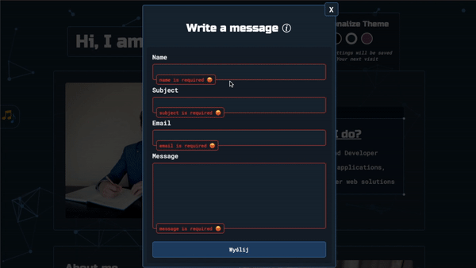

<br/>

<h3 id="form-notifications-logic">3.15 Description of the inputs (text, email and textarea) notifications logic with the handleFormTextInputNotificationClick method <a href="#form-inputs-logic-part">⬆</a></h3>

As I explained before, each input created is closely related to a set (array) of notifications, which we also saw in the previous subsection.

Each of the notifications (except for the input notification of the submit type) has a listener set to event click, which calls the handleFormTextInputNotificationClick method with passing an input element.

<br/>

Below is a fragment of the createFormFieldsElements method, in which we see notifications (notificationEls) that have the x method set to event click and the implementation of this method:

```js
//scripts/objects/Form.js file:

    const notificationEls = notifications.map((notificationEl) =>
      createElementFn({
        element: elements.span,
        attributes: [{ name: common.fieldname, value: name }],
        classes: [
          type === common.submit
            ? classNames.form.fieldSubmitNotification
            : classNames.form.fieldInputNotification,
        ],
        innerHTML: notificationEl,
        listeners: [
          {
            event: events.click,
            cb: (e) => {
              type !== common.submit &&
                this.handleFormTextInputNotificationClick({
                  notification: e.target,
                })
            },
          },
        ],
      })
    )

    handleFormTextInputNotificationClick({ notification }) {
      notification.parentElement
        .querySelector(
          notification.attributes.fieldname.value === common.message
            ? elements.textarea
            : elements.input
        )
        .focus()
    }
```

As we can see above, this method is not complicated and only on the basis of the passed notification element it looks for the appropriate input element, on which it calls the focus method (which works like pressing the given input by the user - it calls the handleFormTextInputFocus method described earlier).

This solution has been introduced because sometimes the user will click on the notification instead of the input element, and thanks to this, the user will be able to write.

<br/>

Below is a visual example of this solution:

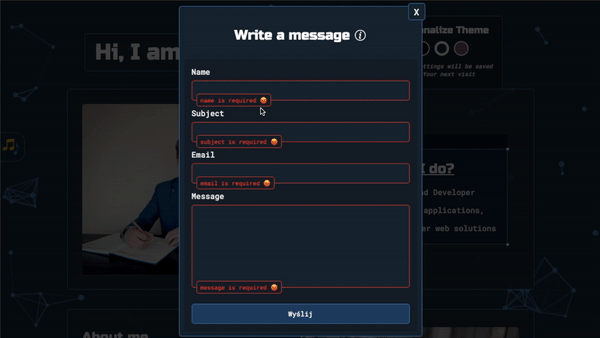

<br/>

### FORM SUBMIT LOGIC PART:

<h3 id="form-submit-logic">3.16. Description of the form submit logic with the handleFormSubmit method <a href="#form-submit-logic-part">⬆</a></h3>

The handleFormSubmit method is responsible for handling the logic of sending data to the server and the behavior of the form component. This method is called by the event submit, which was set in the this.form element (the call is done directly by clicking the input type submit).

<br/>

Below is a fragment of the createMainElements method in which the this.form element is created and the implementation of the handleFormSubmit method:

```js
//scripts/objects/Form.js file:

    this.form = createElementFn({
      element: elements.form,
      classes: [classNames.form.main],
      noValidate: true,
      listeners: [
        { event: events.submit, cb: (e) => this.handleFormSubmit(e) },
      ],
    })

    async handleFormSubmit(e) {
      e.preventDefault()
      const isEmailValidate = this.emailValidate()
      const emptyTextInputs = this.findEmptyFormTextInputs()

      this.formEmailInput.value &&
        !isEmailValidate &&
        this.toggleFormTextInputsNotification({
          toggle: toggleValue.on,
          inputs: [this.formEmailInput],
          notificationNumber: 1,
        })
      emptyTextInputs.length &&
        this.toggleFormTextInputsNotification({
          toggle: toggleValue.on,
          inputs: emptyTextInputs,
        })

      if (!isEmailValidate || emptyTextInputs.length) return

      this.disableFormInputs()
      this.toggleDeleteBtnComponent({ toggle: toggleValue.off })
      this.toggleSpinnerComponent({ toggle: toggleValue.on })
      this.toggleFormSubmitInputlNotifications({
        toggle: toggleValue.on,
        notificationDuration: 5000,
      })
      curtain.togglePreventHidden({ toggle: toggleValue.on })

      const feedback = await this.handleEmailSent()

      this.resetFormTextInputsValue()
      this.toggleSpinnerComponent({ toggle: toggleValue.off })
      this.toggleFormSubmitInputlNotifications({ toggle: toggleValue.off })
      this.hideTitleInfo()
      this.hideFormComponent()
      this.replaceTitleText({ text: feedback })
      this.reduceMainComponentHeight()
      this.moveTitleComponent()
      this.revealTitleWhisper()

      await setDelayFn(2000)
      this.setSelfDestructEventToMainComponent()
      curtain.togglePreventHidden({ toggle: toggleValue.off })
    }
```

As we can see in the example above, the handleFormSubmit is an asynchronous method because in this method we have a asynchronous method and function for which we have to wait:

- handleEmailSent method (responsible for sending the form data to the server)
- setDelayFn helper (which is used to suspend the described method for a certain period of time)

<br/>

<h3 id="form-emailvalidate-method">3.17. Description of the emailValidate method (inside the handleFormSubmit method) <a href="#form-submit-logic-part">⬆</a></h3>

At the very beginning of the discussed handleFormSubmit method, we have the default event blocked by preventDefault method and then we have a method call that validates the email entered by the user (emailValidate) which is returned true/valse value to the isEmailValidate variable.

<br/>

Below is an implementation of this method along with the data it uses:

```js
//data/global/names.js file:

  export const emailValidationRegexp = /^(([^<>()[\]\\.,;:\s@"]+(\.[^<>()[\]\\.,;:\s@"]+)*)|(".+"))@((\[[0-9]{1,3}\.[0-9]{1,3}\.[0-9]{1,3}\.[0-9]{1,3}\])|(([a-zA-Z\-0-9]+\.)+[a-zA-Z]{2,}))$/


//scripts/objects/Form.js file:

  emailValidate() {
    return emailValidationRegexp.test(
      String(this.formEmailInput.value).toLowerCase()
    )
  }
```

As we can see above, this is a simple method that uses the values assigned to the emailValidationRegexp variable to determine the correctness of the entered email (return true/false value).

<br/>

<h3 id="form-findemptyformtextinputs-method">3.18. Description of the findEmptyFormTextInputs method (inside the handleFormSubmit method) <a href="#form-submit-logic-part">⬆</a></h3>

Going further in the handleFormSubmit method, we call the findEmptyFormTextInputs method, which returns true/false value to the emptyTextInputs variable.

<br/>

Below is an example with implementation of this method:

```js
//scripts/objects/Form.js file:

  findEmptyFormTextInputs() {
    let emptyInputs = []

    this.formTextInputs.map((input) => {
      if (input.value === '') {
        emptyInputs.push(input)
      }
    })

    return emptyInputs
  }
```

As we can see in the above example, it is a simple method that checks the value of inputs (except for the input type submit) and depending on whether it has a value or not, it returns false/true.

<br/>

<h3 id="form-toggleformtextinputsnotification-on-method">3.19. Description of the toggleFormTextInputsNotification method (toggle "on") (inside the handleFormSubmit method) <a href="#form-submit-logic-part">⬆</a></h3>

Next, in the handleFormSubmit method we have two conditional calls to the toggleFormTextInputsNotification method, which will be called when:

- the input this.formEmailInput has the entered incorrect e-mail value,
- no values have been entered into the inputs.

<br/>

The following is the example with portion of the handleFormSubmit method in question, along with the implementation of toggleFormTextInputsNotification method:

```js
//scripts/objects/Form.js file:

    this.formEmailInput.value &&
      !isEmailValidate &&
      this.toggleFormTextInputsNotification({
        toggle: toggleValue.on,
        inputs: [this.formEmailInput],
        notificationNumber: 1,
      })

    emptyTextInputs.length &&
      this.toggleFormTextInputsNotification({
        toggle: toggleValue.on,
        inputs: emptyTextInputs,
      })

    toggleFormTextInputsNotification({ toggle, inputs, notificationNumber }) {
      setClassesFn({
        toggle,
        objs: [
          {
            elements: inputs,
            classes: [classNames.utilities.border.danger],
          },
        ],
      })

      inputs.map((input) => {
        const notificationEls = [
          ...input.parentElement.querySelectorAll(elements.span),
        ]

        const rightNotificationEls =
          toggle === toggleValue.on
            ? [notificationEls[notificationNumber ? notificationNumber : 0]]
            : notificationEls

        setPropsFn({
          toggle,
          objs: [
            {
              elements: rightNotificationEls,
              styleProps: [
                {
                  name: styleProps.names.visibility,
                  values: {
                    on: styleProps.values.visible,
                    off: styleProps.values.hidden,
                  },
                },
                {
                  name: styleProps.names.opacity,
                  values: { on: 1, off: 0 },
                },
              ],
            },
          ],
        })
      })
  }
```

The method we see above has already been presented when discussing the input logic (in the case of toggle value "off"). In the first case, apart from the "on" value of the toggle and the input element passed to this method, the so-called notificationNumber with the value 1 is passed (the right number of the notification to be displayed). In the second case, the notificationNumber value was not specified, so the default notification was chosen.

After selecting the appropriate notification, the helper setClassesFn sets the red border of the notification input of related notification, and the helper setProps reveals this notification.

<br/>

At the very end of this part of the discussed process, we have the following piece of code:

```js
//scripts/objects/Form.js file:

if (!isEmailValidate || emptyTextInputs.length) return
```

As we can see above, it is a simple condition, in which if the email is invalid and some of the inputs have no values entered, the entire handleFormSubmit method is returned (we will not go to the further process of this method).

<br/>

Below is a visual examples of the appearance of various notifications:

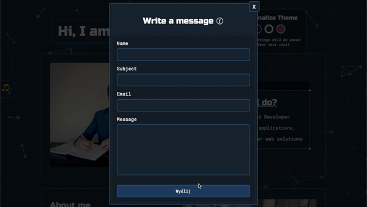

<br/>

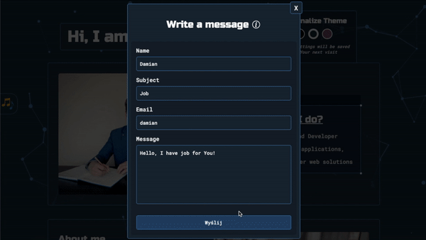

<br/>

<h3 id="form-disableforminputs-method">3.20. Description of the disableFormInputs method (inside the handleFormSubmit method) <a href="#form-submit-logic-part">⬆</a></h3>

Going further in the logic of the handleFormSubmit method, when all the values have been entered correctly we have a disableFormInputs method call.

<br/>

Its implementation is shown below:

```js
//scripts/objects/Form.js file:

  disableFormInputs() {
    const formInputs = [this.formSubmitInput, ...this.formTextInputs]

    formInputs.map((input) =>
      setPropsFn({
        objs: [
          {
            elements: [input],
            props: [
              {
                name: elementProps.names.disabled,
                value: true,
              },
            ],
            styleProps: [
              {
                name: styleProps.names.opacity,
                value: 0.4,
              },
            ],
          },
        ],
      })
    )
  }
```

As we can see above, it is a simple method which, through the setPropsFn helper, sets all the inputs of the form (also including the submit type input) to disabled (setting slightly transparent inputs by reduce opacity for a better user experience).
This solution was introduced so that the user could not enter anything when sending the data form.

<br/>

A visual example of excluding inputs from use is shown below:

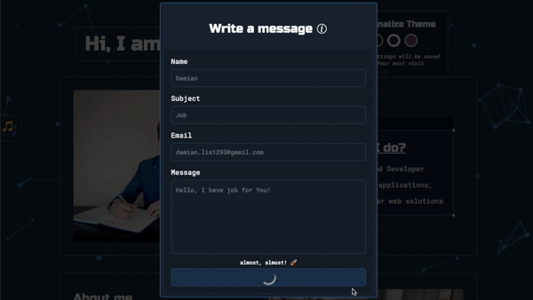

<br/>

<h3 id="form-toggledeletebtncomponent-off-method">3.21. Description of the toggleDeleteBtnComponent method (toggle "off") (inside the handleFormSubmit method) <a href="#form-submit-logic-part">⬆</a></h3>

Then in the method handleFormSubmit we have a toggleDeleteBtnComponent method call with passing toggle value "off".

<br/>

The implementation of mentioned method along with a fragment of the call of this method is below:

```js
//scripts/objects/Form.js file:

  this.toggleDeleteBtnComponent({ toggle: toggleValue.off })

  toggleDeleteBtnComponent({ toggle }) {
    setPropsFn({
      toggle,
      objs: [
        {
          elements: [this.btnDeleteComponent],
          styleProps: [
            {
              name: styleProps.names.visibility,
              values: {
                on: styleProps.values.visible,
                off: styleProps.values.hidden,
              },
            },
            {
              name: styleProps.names.opacity,
              values: {
                on: 1,
                off: 0,
              },
            },
          ],
        },
      ],
    })
  }
```

As we can see in the above example, through the setPropsFn helper, styles are set to this.btnDeleteComponent, which hide this component (toggle value "off") that is responsible for removing the form after clicking (this was entered so that the user could not remove the window of form durign the data when sending).

<br/>

<h3 id="form-togglespinnercomponent-on-method">3.22. Description of the toggleSpinnerComponent method (toggle "on") (inside the handleFormSubmit method) <a href="#form-submit-logic-part">⬆</a></h3>

Going further in the logic of the handleFormSubmit method we have a toggleSpinnerComponent method call with passing toggle value "on".

<br/>

The implementation of mentioned method along with a fragment of the call of this method is below:

```js
//scripts/objects/Form.js file:

  this.toggleSpinnerComponent({ toggle: toggleValue.on })

  toggleSpinnerComponent({ toggle }) {
    setPropsFn({
      toggle,
      objs: [
        {
          elements: [this.formSubmitInput],
          styleProps: [
            {
              name: styleProps.names.display,
              values: {
                on: styleProps.values.none,
                off: styleProps.values.block,
              },
            },
          ],
        },
        {
          elements: [this.formSpinnerComponent],
          styleProps: [
            {
              name: styleProps.names.display,
              values: {
                on: styleProps.values.flex,
                off: styleProps.values.none,
              },
            },
          ],
        },
      ],
    })
  }
```

As we can see above, this simple method, through the setPropsFn helper, in the case of passed toggle value "on" allows to hide the input type submit and show the loading spinner (for a better user experience during sending form data to server).

<br/>

Below is a visual example of this solution:

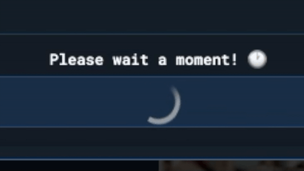

<br/>

<h3 id="form-toggleformsubmitinputnotifications-on-method">3.23. Description of the toggleFormSubmitInputlNotifications method (toggle "on") (inside the handleFormSubmit method) <a href="#form-submit-logic-part">⬆</a></h3>

Then in the method handleFormSubmit we have a toggleFormSubmitInputlNotifications method call with passing "on" value of the toggle parameter and "5000" value of the notificationDuration parameter.

<br/>

The implementation of mentioned method along with a fragment of the call of this method is below:

```js
//scripts/objects/Form.js file:

    this.toggleFormSubmitInputlNotifications({
      toggle: toggleValue.on,
      notificationDuration: 5000,
    })

    toggleFormSubmitInputlNotifications({ toggle, notificationDuration = {} }) {
      const formSubmitnotificationEls = [
        ...this.formSubmitInput.parentElement.querySelectorAll(elements.span),
      ]

      switch (toggle) {
        case toggleValue.on:
          formSubmitnotificationEls.map((notificationEl, index) => {
            const lastNotification =
              formSubmitnotificationEls.length === index + 1
            const delay = index * notificationDuration

            const appearNotificationTimeout = setPropsFn({
              objs: [
                {
                  elements: [notificationEl],
                  styleProps: [
                    {
                      name: styleProps.names.visibility,
                      value: styleProps.values.visible,
                    },
                    {
                      name: styleProps.names.opacity,
                      value: 1,
                    },
                  ],
                },
              ],
              delay,
            })

            this.notificationTimeouts.push(appearNotificationTimeout)

            if (!lastNotification) {
              const hideNotificationTimeout = setPropsFn({
                objs: [
                  {
                    elements: [notificationEl],
                    styleProps: [
                      {
                        name: styleProps.names.visibility,
                        value: styleProps.values.hidden,
                      },
                      {
                        name: styleProps.names.opacity,
                        value: 0,
                      },
                    ],
                  },
                ],
                delay: delay + notificationDuration,
              })
              this.notificationTimeouts.push(hideNotificationTimeout)
            }
          })
          break

        case toggleValue.off:
          setPropsFn({
            objs: [
              {
                elements: formSubmitnotificationEls,
                styleProps: [
                  {
                    name: styleProps.names.display,
                    value: styleProps.values.none,
                  },
                ],
              },
            ],
          })

          this.notificationTimeouts.map((notificationTimeout) => {
            clearInterval(notificationTimeout)
          })
          break

        default:
          break
      }
  }
```

As we can see above, it is a fairly extensive method, in which all notifications about input with the submit type are searched at the beginning. Then, when the toggle parameter with the value "on" is passed to the method (as in the discussed case), two setProps helpers are called depending on the length of the notification array . The first helper sets the appropriate styles to appear notification after the specified time, which increases with iteration through the array with notification elements (index \* notificationDuration), and the second helper sets the removal of previously set styles after a set time (delay + notificationDuration).

In the case of the last iteration on the notification elements array, the second helper, which removes the set styles by the earlier one, is not called (so that the user can see the notification continuously until he receives a response from the server).

Each of the called helpers is returned (setTimoeuts of these functions) to a variable (appearNotificationTimeout and hideNotificationTimeout) that is added to the this.notificationTimeouts array during each iteration. Thanks to this, in the case of calling the toggleFormSubmitInputlNotifications method with toggle parameter of the value "off" (after receiving a reply from the server - a situation to be discussed later), we can refer to the setTimeouts, remove them and we clean the this.notificationTimeouts array (so that when the user receives a message from the server earlier, there are no setTimout functions that have not been called yet).

Thanks to this solution, we have a smooth appearance and disappearance of individual notifications regarding input of the submit type within a specified time.

<br/>

Below is an example of the discussed solution:


<br/>

<h3 id="form-togglepreventhidden-on-method">3.24. Description of the togglePreventHidden method (toggle "on") of the Curtain object (inside the handleFormSubmit method) <a href="#form-submit-logic-part">⬆</a></h3>

Next up, as we'll see in the handleFormSubmit method, we call the togglePreventHidden method of the Curtain object which prevents the form from being deleted through the curtain element (this method was explained at the time of describing the Curtain object).

<br/>

The following is an example of calling it in the handleFormSubmit method:

```js
//scripts/objects/Form.js file:

curtain.togglePreventHidden({ toggle: toggleValue.on })
```

As we can see above, when calling the method, we pass the toggle parameter with the value "on" (thanks to this, the possibility of removing the curtain is blocked).

<br/>

Below is a visual example of this solution:


<br/>

<h3 id="form-handleemailsent-method">3.25. Description of the handleEmailSent method (inside the handleFormSubmit method) <a href="#form-submit-logic-part">⬆</a></h3>

After blocking the possibility of removing the form, the method x is called, which is returned to the variable feedback.

<br/>

Below is a fragment of the handleFormSubmit method in which the discussed method is called and its implementation next to it:

```js
//scripts/objects/Form.js file:

    const feedback = await this.handleEmailSent()

    async handleEmailSent() {
    return await fetch(mailEndPoint, {
      method: fetchProps.methods.POST,
      headers: {
        [fetchProps.headers.props.ContentType]:
          fetchProps.headers.values.applicationJson,
      },
      body: JSON.stringify(this.dataFromUser),
    })
      .then((response) => response.json())
      .then((data) =>
        data.success ? info.messageSent : info.somethingWentWrong
      )
      .catch(() => info.unableToConnect)
  }
```

As we can see, it is a simple method that uses the fetch function to send the collected data via a form to the appropriate endpoint (`https://dirt-ten-risk.glitch.me/api/mail/portfolio`) of the server (my backend application [Emails Handler](https://github.com/damian-lis/Emails-handler) that supports various e-mail services).

<br/>

Depending on the response from the server, an appropriate message is returned from discussed method:

- info.messageSent - when the message was sent,
- info.somethingWentWrong - when, for example, something happened with the email service or by incorrectly sent data to this email service,
- info.unableToConnect - when there is no connection to the server.

<br/>

Below are three examples of replies from the server:

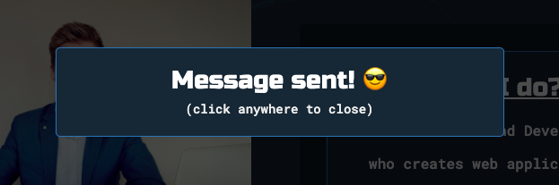

<br/>

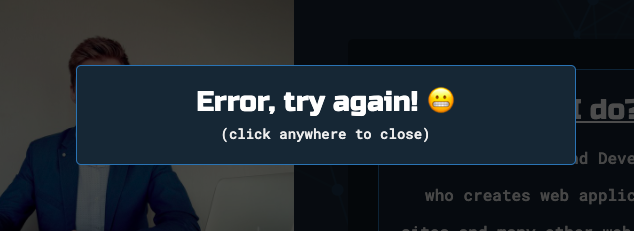

<br/>

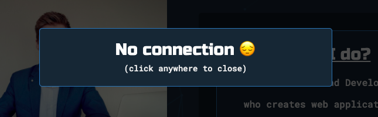

<br/>

<h3 id="form-resetformtextinputsvalue-method">3.26. Description of the resetFormTextInputsValue method (inside the handleFormSubmit method) <a href="#form-submit-logic-part">⬆</a></h3>

After receiving the response from the server, the resetFormTextInputsValue method is first called.

<br/>

Below is a fragment of the handleFormSubmit method in which the discussed method is called and its implementation next to it:

```js
//scripts/objects/Form.js file:

  this.resetFormTextInputsValue()

  resetFormTextInputsValue() {
    this.formTextInputs.map((input) => (input.value = ''))
  }
```

As we can see above, it is a very simple method that removes the value of all inputs (except for the submit type).

<br/>

Below is a visual example of this method:

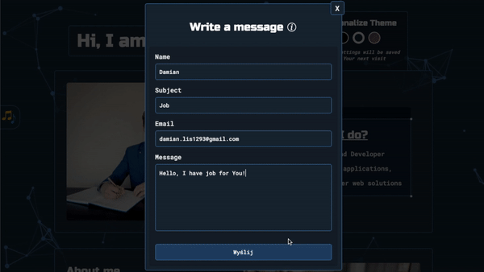

<br/>

<h3 id="form-togglespinnercomponent-off-method">3.27. Description of the toggleSpinnerComponent method (toggle "off") (inside the handleFormSubmit method) <a href="#form-submit-logic-part">⬆</a></h3>

Next, the handleFormSubmit method calls toggleSpinnerComponent with the toggle parameter set to "off".

<br/>

Below I will present just an example of calling this method because its logic has already been discussed earlier, and in this case it just works the opposite (the spinner is replaced with input type submit):

```js
//scripts/objects/Form.js file:

this.toggleSpinnerComponent({ toggle: toggleValue.off })
```

<br/>

<h3 id="form-toggleformsubmitinputnotifications-off-method">3.28. Description of the toggleFormSubmitInputlNotifications method (toggle "off") (inside the handleFormSubmit method) <a href="#form-submit-logic-part">⬆</a></h3>

Then, after replacing the spinner with input of type submit, the toggleFormSubmitInputlNotifications method is called:

```js
//scripts/objects/Form.js file:

this.toggleFormSubmitInputlNotifications({ toggle: toggleValue.off })
```

I am not providing an implementation example here because the logic of this method has been explained earlier (also in the case of the passed toggle parameter with the value "off"). I will just add that this method in this case removes the notifications that appear while the user is waiting for a response from the server.

<br/>

<h3 id="form-hidetitleinfo-method">3.29. Description of the hideTitleInfo method (inside the handleFormSubmit method) <a href="#form-submit-logic-part">⬆</a></h3>

Next, we have a series of methods that are responsible for the final animation of the form component.

<br/>

First, the hideTitleInfo method is called, the calling example and implementation of which is shown below:

```js
//scripts/objects/Form.js file:

    this.hideTitleInfo()

    hideTitleInfo() {
    setPropsFn({
      objs: [
        {
          elements: [this.infoComponent],
          styleProps: [
            {
              name: styleProps.names.display,
              value: styleProps.values.none,
            },
          ],
        },
      ],
    })
  }
```

As we can see above, it is a simple method that uses the setPropsFn helper, which hides the this.infoComponent element (an information icon with an information window regarding the waiting time for a response from the server).

(an example of this animation is provided at the end of the description (including other animations) of all methods involved in animating a form component).

<br/>

<h3 id="form-hideformcomponent-method">3.30. Description of the hideFormComponent method (inside the handleFormSubmit method) <a href="#form-submit-logic-part">⬆</a></h3>

The next step is to call the hideFormComponent method, the calling example and implementation of which is shown below:

```js
//scripts/objects/Form.js file:

    this.hideFormComponent

    hideFormComponent() {
    setPropsFn({
      objs: [
        {
          elements: [this.formMainComponent],
          styleProps: [
            {
              name: styleProps.names.overflow,
              value: styleProps.values.hidden,
            },
            {
              name: styleProps.names.opacity,
              value: 0,
            },
          ],
        },
      ],
    })
  }
```

As we can see above this is a method which also uses the setPropsFn helper which hides the this.formMainComponent element.

(an example of this animation is provided at the end of the description (including other animations) of all methods involved in animating a form component).

<br/>

<h3 id="form-replacetitletext-method">3.31. Description of the replaceTitleText method (inside the handleFormSubmit method) <a href="#form-submit-logic-part">⬆</a></h3>

After hiding this.formMainComponent element, the method replaceTitleText is called, the calling example and implementation of which is shown below:

```js
//scripts/objects/Form.js file:

  this.replaceTitleText({ text: feedback })

  replaceTitleText({ text }) {
    setPropsFn({
      objs: [
        {
          elements: [this.title],
          props: [
            {
              name: elementProps.names.innerHTML,
              value: text,
            },
          ],
        },
      ],
    })
  }
```

As we can see above, calling this method takes place with the feedback argument (in the form of the text prop), which contains information about the response from the server (I discussed this earlier).

This method overrides the innerHTML property of this.title element with the sent information (text) through the setPropsFn helper.

(an example of this animation is provided at the end of the description (including other animations) of all methods involved in animating a form component).

<br/>

<h3 id="form-reducemaincomponentheight-method">3.32. Description of the reduceMainComponentHeight method (inside the handleFormSubmit method) <a href="#form-submit-logic-part">⬆</a></h3>

After the method I just described, the method reduceMainComponentHeight is called, the calling example and implementation of which is shown below:

```js
//scripts/objects/Form.js file:

  this.reduceMainComponentHeight({ delay: 800 })

  reduceMainComponentHeight({ delay }) {
    setPropsFn({
      objs: [
        {
          elements: [this.mainComponent],
          styleProps: [
            {
              name: styleProps.names.height,
              value: '100px',
            },
          ],
        },
      ],
      delay
    })
  }
```

As we can see above, the method is called with a delay argument that specifies the time after which this method is to be called.

This method reduces the size of this.mainComponent to 100px via the setPropsFn helper after 800 milliseconds (delay).

(an example of this animation is provided at the end of the description (including other animations) of all methods involved in animating a form component).

<br/>

<h3 id="form-movetitlecomponent-method">3.33. Description of the moveTitleComponent method (inside the handleFormSubmit method) <a href="#form-submit-logic-part">⬆</a></h3>

The penultimate method that applies to animating a form component is the moveTitleComponent method, the calling example and implementation of which is shown below:

```js
//scripts/objects/Form.js file:

  this.moveTitleComponent()

  moveTitleComponent() {
    setPropsFn({
      objs: [
        {
          elements: [this.titleComponent],
          styleProps: [
            {
              name: styleProps.names.top,
              value: '50%',
            },
            {
              name: styleProps.names.position,
              value: styleProps.values.relative,
            },
            {
              name: styleProps.names.transform,
              value: styleProps.values.translateY(-70),
            },
          ],
        },
      ],
    })
  }
```

As we can see above, this method through the setPropsFn helper sets a number of properties on the this.titleComponent element, thanks to which we obtain the effect of moving this element to the middle of form component.

(an example of this animation is provided at the end of the description (including other animations) of all methods involved in animating a form component)

<br/>

<h3 id="form-revealtitlewhisper-method">3.34. Description of the revealTitleWhisper method with the visual animation example (inside the handleFormSubmit method) <a href="#form-submit-logic-part">⬆</a></h3>

The last method related to the animation of component forms is the revealTitleWhisper method, the calling example and implementation of which is shown below:

```js
//scripts/objects/Form.js file:

    this.revealTitleWhisper({ delay: 1800 })

    revealTitleWhisper() {
    setPropsFn({
      objs: [
        {
          elements: [this.whisper],
          styleProps: [
            {
              name: styleProps.names.opacity,
              value: 1,
            },
          ],
        },
      ],
      delay: 1800,
    })
  }
```

As we can see above, it is a method that is passed a delay argument of 1800 value (the delay time when calling the method).

The method itself, through the setPropsFn helper, reveals the this.whisper element to the user (information that by clicking anywhere on the screen the form component will be deleted).

<br/>

Below is a visual example of the form component animation methods discussed above:


<br/>

<h3 id="form-setdelayfn-helper">3.35. Description of the setDelayFn helper (inside the handleFormSubmit method) <a href="#form-submit-logic-part">⬆</a></h3>

After the methods calling the animation the setDelayFn helper is called, the example of which is shown below:

```js
//scripts/objects/Form.js file:

await setDelayFn(2000)
```

The helper we see above (the logic of the helper shown above was discussed in the section on helpers) executes at the same time as the form component animation methods and is used to delay the handleFormSubmit method for 2 seconds before the next methods are called (so that the animation can complete itself).

<br/>

### FORM DELETE LOGIC PART:

<h3 id="form-setselfdesctructeventtomaincomponent-method">3.36. Description of the setSelfDestructEventToMainComponent method (inside the handleFormSubmit method) <a href="#form-delete-logic-part">⬆</a></h3>

After the handleFormSubmit method is delayed via the setDelayFn helper, the setSelfDestructEventToMainComponent method is called, the calling example and implementation of which is shown below:

```js
//scripts/objects/Form.js file:

  this.setSelfDestructEventToMainComponent()

  setSelfDestructEventToMainComponent() {
    setPropsFn({
      objs: [
        {
          elements: [this.mainComponent],
          listeners: [
            {
              event: events.click,
              cb: () => curtain.toggleShow({ toggle: toggleValue.off }),
            },
          ],
        },
      ],
    })
  }
```

As we can see above, it is a method that sets the listener to the event click on the this.mainComponent element, which calls the toggleShow method of the Curtain object, passing to it the toggle parameter with the value "off" (by clicking on this.mainComponent this element will be removed from the curtain structure).

(the exact operation of the toggleShow method is explained in the Curtain object section)

<br/>

Below is a visual example of this solution:


<br/>

<h3 id="form-togglepreventhidden-off-method">3.37. Description of the togglePreventHidden method (toggle "off") of the Curtain object (inside the handleFormSubmit method) <a href="#form-delete-logic-part">⬆</a></h3>

At the very end of the handleFormSubmit method is the togglePreventHidden method of Curtain object, which is called as follows:

```js
//scripts/objects/Form.js file:

curtain.togglePreventHidden({ toggle: toggleValue.off })
```

As we can see above, this method is called with the toggle parameter set to "off", thanks to which the option to remove the curtain child (in this case, this.mainComponent) is activated (the exact operation of the togglePreventHidden method is explained in the Curtain object section).

<br/>

Below is a visual example of this solution

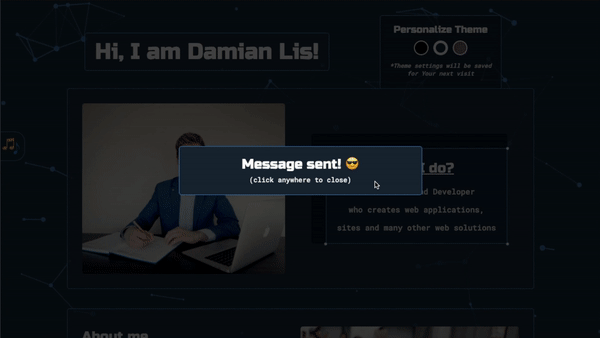

<br/>

<h3 id="form-delete">3.38. Description of delete a form component through the this.btnDelete element <a href="#form-delete-logic-part">⬆</a></h3>

Removing the form component is also done through the this.btnDelete element, which is presented below as a part of the createMainElements method:

```js
//scripts/objects/Form.js file:

this.btnDelete = createElementFn({
  element: elements.button,
  classes: [classNames.form.btnDelete],
  textContent: 'X',
  listeners: [
    {
      event: events.click,
      cb: () => curtain.toggleShow({ toggle: toggleValue.off }),
    },
  ],
})
```

As we can see above, on the this.btnDelete element, the listener is set to the click event, which calls the previously described toggleShow method of the Curtain object, passing the toggle parameter with the value "off" (the form component is removed from the Curtain object structure).

The exact operation of the toggleShow method is explained in the Curtain object section.

<br/>

Below is a visual example of this solution (along with an example of clicking on the curtain)


<br/>
<br/>

<h3 id="back-object">3.2.7. Possibility to go back to the home page by Back object <a href="#specific-main">⬆</a></h3>

<p id="back-list">Table of content of this section:</p>

1. [Introdution](#back-introduction)

2. [Description of creating an instance of the Back object](#back-instance)

3. [Description of the Back object logic](#back-logic)

<br/>

<h3 id="back-introduction">1. Introdution <a href="#back-list">⬆</a></h3>

The functionality that I would like to describe here concerns the possibility of going back to the home page from each subpage.

As in the case of audio handling and creating a form, this functionality is called by the button on the left side of the screen (for obvious reasons, this button is only available on subpages).

<br/>

Below is a visual example of this solution on the privacy policy page (the same solution applies to subpages related to the descriptions of projects I have created):

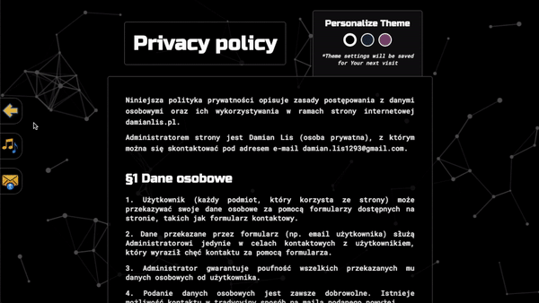

<br/>

<h3 id="back-instance">2. Description of creating an instance of the Back object <a href="#back-list">⬆</a></h3>

In order to implement the logic we see above, an instance of the BackBtn object is created in the file, which constitutes the main script for the privacy policy page (the same operation as for the previous objects discussed).

<br/>

The solution looks as follows:

```js
//scripts/sites/privacyPolicy.js file:

new Back({ container: idReferences.global.leftContainer })
```

As we can see in the example presented above, only the reference of the container element is passed to the created instance (elements created inside of discussed object are attached to it).

<br/>

<h3 id="back-logic">3. Description of the Back object logic <a href="#back-list">⬆</a></h3>

After the presentation of creating an instance of a Back object, I can now move on to presenting the logic behind this object.

<br/>

<p id="back-logic-list">To make it easier to find yourself in the description below, there is a list of topics covered:</p>

&nbsp; 3.1. [Code example of the Back object constructor](#back-code-example)

&nbsp; 3.2. [Description of the createElements method (constructor)](#back-createelements-method)

&nbsp; 3.3. [Description of the createComponents method (constructor)](#back-createcomponents-method)

<br/>

<h3 id="back-code-example">3.1. Code example of the Back object constructor <a href="#back-logic-list">⬆</a></h3>

```js
//scripts/objects/Back.js file:

class Back {
  constructor({ container }) {
    this.createElements()
    this.createComponents()

    appendElementsToContainerFn({ elements: [this.linkComponent], container })
  }
}

export default BackBtn
```

<br/>

<h3 id="back-createelements-method">3.2. Description of the createElements method (constructor) <a href="#back-logic-list">⬆</a></h3>

In the constructor, first, the createElements method is called, the implementation of which is below:

```js
//scripts/objects/Back.js file:

  createElements() {
    this.link = createElementFn({
      element: elements.a,
      href: '/',
      classes: [classNames.global.leftBtn],
    })
    this.arrowImg = createElementFn({
      element: elements.img,
      src: paths.arrowImg,
    })
  }
```

As we can see in the code example above, two elements this.link and this.arrowImg (are created via createElementFn helper) which have a very simple structure.

<br/>

<h3 id="back-createcomponents-method">3.3. Description of the createComponents method (constructor) <a href="#back-logic-list">⬆</a></h3>

Next, in the constructor of discussed object, we call the createComponents method, the implementation of which is below:

```js
//scripts/objects/Back.js file:

  createComponents() {
    this.linkComponent = appendElementsToContainerFn({
      elements: [this.arrowImg],
      container: this.link,
    })
  }
```

As we can see in code example above, this method combines previously created elements into the so-called component (this.linkComponent) via helper appendElementsToContainer.

<br/>
<br/>

<h3 id="sneakpeeks-object">3.2.8. Create project sneak peeks by SneakPeeks object <a href="#specific-main">⬆</a></h3>

<p id="sneakpeeks-list">Table of content of this section:</p>

1. [Introdution](#sneakpeeks-introduction)

2. [Description of creating an instance of the SneakPeeks object](#sneakpeeks-instance)

3. [Description of the SneakPeeks object logic](#sneakpeeks-logic)

<br/>

<h3 id="sneakpeeks-introduction">1. Introdution <a href="#sneakpeeks-list">⬆</a></h3>

Sneak peeks of the projects that I have created appear at the bottom of the home page. It looks like this:

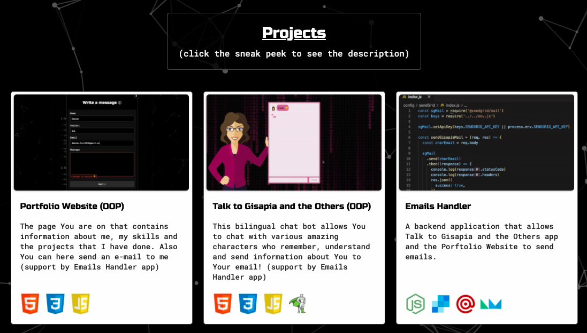

<br/>

<h3 id="sneakpeeks-instance">2. Description of creating an instance of the SneakPeeks object <a href="#sneakpeeks-list">⬆</a></h3>

Before I go to the description of the logic of this object, which is responsible for creating the sneak peeks presented above, I would like to present the process of creating its instance with the pass of appropriate parameters.

<br/>

Below is an example of creating an instance of a SneakPeeks object (alongside other instances of other objects) in sites/home.js file which is the main script for index.html (home page):

```js
//scripts/sites/index.js file:

new SneakPeeks({
  container: idReferences.sneakPeeks.main,
  trigger: idReferences.sneakPeeks.trigger,
  wrapper: idReferences.sneakPeeks.wrapper,
  data: sneakPeeksInfo,
})
```

As we can see in the example above, the following parameters (in object) are passed to the SneakPeeks object:

- container that corresponds to idReferences.sneakPeeks.main which is a reference to the container to which the object with created snippets will be attached,
- trigger that corresponds to idReferences.sneakPeeks.trigger which is a reference to the action trigger element, which we know from the description earlier objects,
- wrapper that corresponds to idReferences.sneakPeeks.wrapper which is a reference to the element that is closely related to the trigger (will be explained later),
- data that corresponds to sneakPeeksInfo (from data/informations/senakPeeks.js file) which is the data on the basis of which sneak peeks elements are created.

<br/>

<h3 id="sneakpeeks-logic">3. Description of the SneakPeeks object logic <a href="#sneakpeeks-list">⬆</a></h3>

After the presentation of creating an instance of a SneakPeeks object, I can now move on to presenting the logic behind this object.

<br/>

<p id="sneakpeeks-logic-list">To make it easier to find yourself in the description below, there is a list of topics covered:</p>

&nbsp; 3.1. [Code example of the SneakPeeks object constructor](#sneakpeeks-code-example)

&nbsp; 3.2. [Description of the variables of the object constructor](#sneakpeeks-constructor-variables)

&nbsp; 3.3. [Description of the createElements method (constructor)](#sneakpeeks-createelements-method)

&nbsp; 3.4. [Description of the createComponents method (constructor)](#sneakpeeks-createcomponents-method)

&nbsp; 3.5. [Description of use the appendElementsToContainerFn helper (constructor)](#sneakpeeks-appendelementstocontainerfn-helper)

&nbsp; 3.6. [Code example and description of the data/informations/sneakPeeks.js file](#sneakpeeks-data)

&nbsp; 3.7. [Description of use the triggerActionOnWindowScrollFn helper with the related handleOnEnterTriggerEl method (constructor)](#sneakpeeks-triggeractiononwindowscrollfn-helper)

<br/>

<h3 id="sneakpeeks-code-example">3.1. Code example of the SneakPeeks object constructor <a href="#sneakpeeks-logic-list">⬆</a></h3>

Below is the constructor implementation of the discussed object:

```js
//scripts/objects/SneakPeeks.js file:

class SneakPeeks {
  constructor({ container, trigger, wrapper, data }) {
    this.sneakPeeksInfo = data

    this.createElements()
    this.createComponents()
    appendElementsToContainerFn({ elements: [this.mainComponent], container })

    if (trigger) {
      this.triggerElement = document.querySelector(trigger)
      this.wrapperElement = document.querySelector(wrapper)
      triggerActionOnWindowScrollFn({
        onWhatElement: trigger,
        cbOnEnterTriggerEl: () => this.handleOnEnterTriggerEl(),
      })
    }
  }
}
```

<br/>

<h3 id="sneakpeeks-constructor-variables">3.2. Description of the variables of the object constructor <a href="#sneakpeeks-logic-list">⬆</a></h3>

As we can see in the code example above, in the object constructor we have following variables:

- this.sneakPeeksInfo which assign the passed data,
- this.triggerElement which conditionally (whether the trigger reference was sent or not) assign the passed reference to the trigger element,
- this.wrapperElement which conditionally (whether the trigger reference was sent or not) assign the passed reference to the wrapper element.

<br/>

<h3 id="sneakpeeks-createelements-method">3.3. Description of the createElements method (constructor) <a href="#sneakpeeks-logic-list">⬆</a></h3>

After assigning data to this.sneakPeeksInfo variable, the createElements method is called, the implementation of which is below:

```js
//scripts/objects/SneakPeeks.js file:

createElements() {
    this.mainContainer = createElementFn({
      element: elements.div,
      classes: [classNames.sneakPeeks.container],
    })

    this.elements = this.sneakPeeksInfo.map((sneakPeek) => {
      const linkWrapper = createElementFn({
        element: elements.a,
        classes: [classNames.sneakPeek.linkWrapper],
        href: sneakPeek.href,
      })

      const container = createElementFn({
        element: elements.div,
        classes: [classNames.sneakPeek.container],
      })

      const thubnail = createElementFn({
        element: elements.img,
        classes: [classNames.sneakPeek.thubnail],
        src: sneakPeek.image,
        alt: sneakPeek.alt,
      })

      const prevContainer = createElementFn({
        element: elements.div,
        classes: [classNames.sneakPeek.preview],
      })

      const title = createElementFn({
        element: elements.h(6),
        classes: [classNames.sneakPeek.title],
        textContent: sneakPeek.title,
      })

      const intro = createElementFn({
        element: elements.p,
        classes: [classNames.sneakPeek.intro],
        textContent: sneakPeek.intro,
      })

      const iconsContainer = createElementFn({
        element: elements.div,
        classes: [classNames.sneakPeek.iconsContainer],
      })

      const icons = sneakPeek.icons.map((iconEl) =>
        createElementFn({
          element: elements.img,
          src: iconEl.image,
        })
      )

      const ribbonContainer = sneakPeek.duringDevelopment
        ? createElementFn({
            element: elements.div,
            classes: [classNames.sneakPeek.ribbon],
          })
        : null

      const ribbonText = sneakPeek.duringDevelopment
        ? createElementFn({
            element: elements.p,
            classes: [classNames.sneakPeek.ribbonText],
            innerHTML: info.duringDevelopment,
          })
        : null

      return {
        linkWrapper,
        container,
        thubnail,
        prevContainer,
        title,
        intro,
        iconsContainer,
        icons,
        ribbonContainer,
        ribbonText,
      }
    })
  }
```

As we can see above, this is large but very simple method, in which, through the createElementFn helper, a container element (this.mainContainer) and an array of objects (this.elements) with individual sneak peek elements are created.

<br/>

<h3 id="sneakpeeks-createcomponents-method">3.4. Description of the createComponents method (constructor) <a href="#sneakpeeks-logic-list">⬆</a></h3>

Next, in the constructor of discussed object, we call the createComponents method, the implementation of which is below:

```js
//scripts/objects/SneakPeeks.js file:

createComponents() {
    this.sneakPeekComponents = this.elements.map(
      ({
        linkWrapper,
        container,
        thubnail,
        prevContainer,
        title,
        intro,
        iconsContainer,
        icons,
        ribbonContainer,
        ribbonText,
      }) => {
        const prevComponent = appendElementsToContainerFn({
          elements: [title, intro],
          container: prevContainer,
        })

        const iconComponents = appendElementsToContainerFn({
          elements: icons,
          container: iconsContainer,
        })

        let sneakPeekComponent = appendElementsToContainerFn({
          elements: [thubnail, prevComponent, iconComponents],
          container,
        })

        if (ribbonContainer && ribbonText) {
          const ribbonComponent = appendElementsToContainerFn({
            elements: [ribbonText],
            container: ribbonContainer,
          })

          sneakPeekComponent = appendElementsToContainerFn({
            elements: [
              thubnail,
              prevComponent,
              iconComponents,
              ribbonComponent,
            ],
            container,
          })
        }

        const linkSneakPeekComponent = appendElementsToContainerFn({
          elements: [sneakPeekComponent],
          container: linkWrapper,
        })

        return linkSneakPeekComponent
      }
    )

    this.mainComponent = appendElementsToContainerFn({
      elements: this.sneakPeekComponents,
      container: this.mainContainer,
    })
  }
```

As we can see, it is a simple method which, through interactions on a previously created array with objects (this.elements), creates this.sneakPeeksComponents (a set of smaller components), which at the end of the discussed method is appended to this.mainContainer to form this.mainComponent (all connections of elements into components are made via the appendElementsToContainerFn helper).

<br/>

<h3 id="sneakpeeks-appendelementstocontainerfn-helper">3.5. Description of use the appendElementsToContainerFn helper (constructor) <a href="#sneakpeeks-logic-list">⬆</a></h3>

After the above-mentioned methods, the created this.mainComponent component is connected to the container by appendElementsToContainerFn helper.

<br/>

<h3 id="sneakpeeks-data">3.6. Code example and description of the data/informations/sneakPeeks.js file <a href="#sneakpeeks-logic-list">⬆</a></h3>

In order to understand well how given sneak peek elements are created, below is a file (data) with a collection of information on individual projects on the basis of which these elements were created:

```js
//data/informations/sneakPeeks.js file:

export default [
  {
    href: '/sites/portfolioWebsite.html',
    image: '/images/projects/PortfolioWebsite/introDesktop.gif',
    alt: 'Potfolio Website',
    title: 'Portfolio Website (OOP)',
    intro:
      'The page You are on that contains information about me, my skills and the projects that I have done. Also You can here send an e-mail to me (support by Emails Handler app)',
    icons: [
      { image: '/images/icons/technologies/html.jpg' },
      { image: '/images/icons/technologies/css.jpg' },
      { image: '/images/icons/technologies/js.jpg' },
    ],
  },

  {
    href: '/sites/talkToGisapiaAndTheOthers.html',
    image: '/images/projects/TalkToGisapiaAndTheOthers/introDesktop.gif',
    alt: 'Talk to Gisapia and the Others',
    title: 'Talk to Gisapia and the Others (OOP)',
    intro:
      'This bilingual chat bot allows You to chat with various amazing characters who remember, understand and send information about You to Your email! (support by Emails Handler app)',
    icons: [
      { image: '/images/icons/technologies/html.jpg' },
      { image: '/images/icons/technologies/css.jpg' },
      { image: '/images/icons/technologies/js.jpg' },
      { image: '/images/icons/technologies/gsap.svg' },
    ],
  },

  {
    href: '/sites/emailsHandler.html',
    image: '/images/projects/EmailsHandler/emailsHandlerIntro.gif',
    alt: 'Emails Handler',
    title: 'Emails Handler',
    intro:
      'A backend application that allows Talk to Gisapia and the Others app and the Porftolio Website to send emails.',
    icons: [
      { image: '/images/icons/technologies/nodejs.jpg' },
      { image: '/images/icons/technologies/sendgrid.jpg' },
      { image: '/images/icons/technologies/mailgun.jpg' },
      { image: '/images/icons/technologies/nodemailer.svg' },
    ],
  },

  {
    href: '/sites/fluentBlog.html',
    image: '/images/projects/FluentBlog/browseArticle.gif',
    alt: 'FluentBlog',
    title: 'FluentBlog',
    intro:
      'A blog with various articles about the IT industry that uses server side rendering in Next.js technology.',
    icons: [
      { image: '/images/icons/technologies/tailwindcss.jpg' },
      { image: '/images/icons/technologies/next.jpg' },
    ],
  },

  {
    href: '/sites/uniqueChoice.html',
    image: '/images/icons/projects/uniqueChoice.jpg',
    alt: 'Unique Choice',
    title: 'Unique Choice',
    intro:
      'It is an E-Commerce fullstack project with all the functionality that allows You to make purchases.',
    icons: [
      { image: '/images/icons/technologies/bootstrap.jpg' },
      { image: '/images/icons/technologies/react.jpg' },
      { image: '/images/icons/technologies/nodejs.jpg' },
      { image: '/images/icons/technologies//mongodb.jpg' },
    ],
    duringDevelopment: true,
  },

  {
    href: '/sites/leafi.html',
    image: '/images/icons/projects/leaf.jpg',
    alt: 'Leaf',
    title: 'Leaf',
    intro:
      'It is a fullstack project that aims to recreate many functionalities, structures and styles from apple.com.',
    icons: [
      { image: '/images/icons/technologies/react.jpg' },
      { image: '/images/icons/technologies/nodejs.jpg' },
      { image: '/images/icons/technologies/mongodb.jpg' },
    ],
    duringDevelopment: true,
  },
]
```

As we can see in the above example, data is an array of objects, each of which has an appropriate information structure, thanks to which the createElements method during iteration can easly create appropriate elements with appropriate properties.

<br/>

<h3 id="sneakpeeks-triggeractiononwindowscrollfn-helper">3.7. Description of use the triggerActionOnWindowScrollFn helper with the related handleOnEnterTriggerEl method (constructor) <a href="#sneakpeeks-logic-list">⬆</a></h3>

Finally, the triggerActionOnWindowScrollFn helper is executed in the object's constructor, which works a bit differently than the objects mentioned earlier.

The action of the mentioned helper applies to all the sneak peeks when you scroll to sections with id sneakPeeks-trigger (our trigger element).

<br/>

A visual example of this process is shown below:

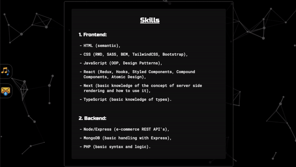

<br/>

In order to describe in detail the logic of the above example, below I would like to mention once again the triggerActionOnWindowScrollFn helper call along with the implementation of the method it calls:

```js
//scripts/objects/SneakPeeks.js file:

    if (trigger) {
      this.triggerElement = document.querySelector(trigger)
      this.wrapperElement = document.querySelector(wrapper)
      triggerActionOnWindowScrollFn({
        onWhatElement: trigger,
        cbOnEnterTriggerEl: () => this.handleOnEnterTriggerEl(),
      })
    }

    handleOnEnterTriggerEl() {
      setClassesFn({
        objs: [
          {
            elements: [this.triggerElement],
            classes: [classNames.utilities.h.full],
          },
          {
            elements: [this.wrapperElement],
            classes: [classNames.utilities.animations.slideInFromTop],
          },
        ],
      })
  }
```

As we can see in the above example, the discussed helper can only be called when the reference to the trigger element is sent to the object (this was introduced because in some cases this element may not be sent).

After checking the condition, before the helper is called, the appropriate elements of the DOM structure are queried: trigger and wrapper.

Then, after queried the appropriate elements from the DOM structure, the discussed helper is called and thanks to this, the method handleOnEnterTriggerEl is called when the trigger element is scrolled (in this case we only have one call without toggle parameter).

The discussed handleOnEnterTriggerEl method using the setClassesFn helper and sets the class associated with the full height on the this.triggerElement element and on the this.wrapperToRelease element the class with the slideInFromTop animation responsible for the effect of sliding from the top.

<br/>
<br/>

<h3 id="descriptionarrange-object">3.2.9. Create descriptions by DescriptionArrange object <a href="#specific-main">⬆</a></h3>

<p id="descriptionarrange-list">Table of content of this section:</p>

1. [Introdution](#descriptionarrange-introduction)

2. [Description of creating an instance of the DescriptionArrange object](#descriptionarrange-instance)

3. [Description of the DescriptionArrange object logic](#descriptionarrange-logic)

<br/>

<h3 id="descriptionarrange-introduction">1. Introdution <a href="#descriptionarrange-list">⬆</a></h3>

Most of the descriptions in the project were created using the DescriptionArrange object. This solution was introduced because creating descriptions in the html file itself is not readable.

In the case of the home site, there is a description of my person and my skills created dynamically by the DescriptionArrange object (such a dynamic description is also created on the privacy policy site and on each subpages with the description of the created project - a visual example of them is provided at the end of this subsection).

<br/>

Below is a visual example of my person and my skills section descriptions on the home site:


<br/>

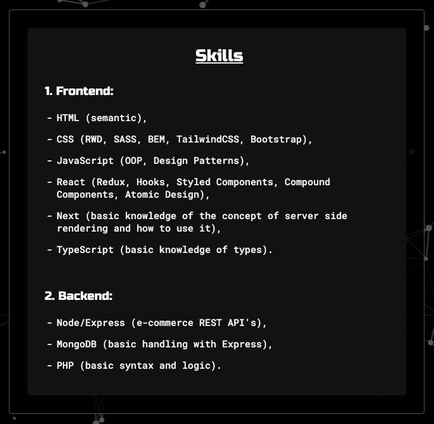

<br/>

Below is a visual example of the TalkToGisapiaAndTheOthers subpage description:


<br/>

<h3 id="descriptionarrange-instance">2. Description of creating an instance of the DescriptionArrange object <a href="#descriptionarrange-list">⬆</a></h3>

To understand the process that is responsible for creating descriptions, I will use the example of descriptions on the home site.

In order to create the descriptions (about and skills section) for home site, two instances of the DescriptionArrange object were created in the home.js file, which is the main script file for the home site (index.html) (along with other object instances).

<br/>

Below is an example of this solution:

```js
//scripts/sites/home.js file:

new DescriptionArrange({
  container: idReferences.about.description,
  data: aboutSectionDescription,
})
new DescriptionArrange({
  container: idReferences.skills.description,
  data: skillsSectionDescription,
})
```

Created instances of the DescriptionArrange object, as we can see above, take the reference to container element to which the element (container) found through this reference will be attached elements created on the basis of the data sent regarding the description (data/sites/home/aboutSection and data/sites/home/skillsSection).

<br/>

<h3 id="descriptionarrange-logic">3. Description of the DescriptionArrange object logic <a href="#descriptionarrange-list">⬆</a></h3>

<p id="descriptionarrange-logic-list">To make it easier to find yourself in the description below, there is a list of topics covered:</p>

&nbsp; 3.1. [Code example of the DescriptionArrange object constructor](#descriptionarrange-code-example)

&nbsp; 3.2. [Description of the variables of the object constructor](#descriptionarrange-constructor-variables)

&nbsp; 3.3. [Description of the createElements method (constructor)](#descriptionarrange-createelements-method)

&nbsp; 3.4. [Description of use the appendElementsToContainerFn helper (constructor)](#descriptionarrange-appendelementstocontainerfn-helper)

<br/>

<h3 id="descriptionarrange-code-example">3.1. Code example of the DescriptionArrange object constructor <a href="#descriptionarrange-logic-list">⬆</a></h3>

The object itself, which is responsible for creating the description is presented below:

```js
//scripts/objects/DescriptionArrange.js file:

class DescriptionArrange {
  constructor({ container, data }) {
    this.description = data

    this.createElements()
    appendElementsToContainerFn({ elements: this.elements, container })
  }
}
```

<br/>

<h3 id="descriptionarrange-constructor-variables">3.2. Description of the variables of the object constructor <a href="#descriptionarrange-logic-list">⬆</a></h3>

As we can see in the code example above, in the constructor we only have one variable this.description that takes an array with objects associated with a given description (data).

<br/>

<h3 id="descriptionarrange-createelements-method">3.3. Description of the createElements method (constructor) <a href="#descriptionarrange-logic-list">⬆</a></h3>

The createElements method is responsible for creating elements, as in the previous objects, which in this case looks as follows:

```js
//scripts/objects/DescriptionArrange.js file:

  createElements() {
    this.elements = this.description.map((object) => {
      switch (object.type) {
        case common.header:
          return createElementFn({
            element: elements.h(object.size),
            innerHTML: object.content,
            classes: object.classes,
            id: object.id,
          })

        case common.paragraph:
          return object.content.map((paragraphContent) =>
            createElementFn({
              element: elements.p,
              classes: object.classes,
              innerHTML: paragraphContent,
              id: object.id,
            })
          )

        case common.list:
          const list = createElementFn({
            element: elements.ul,
            classes: object.classes.list,
          })

          const items = object.content.map((itemContent, index) =>
            createElementFn({
              element: elements.li,
              classes:
                object.content.length - 1 === index
                  ? object.classes.lastItem
                  : object.classes.item,
              innerHTML: itemContent,
            })
          )

          items.map((item) => list.appendChild(item))
          return list

        case common.image:
          return createElementFn({
            element: elements.img,
            classes: object.classes,
            src: object.path,
          })

        case common.code:
          const pre = createElementFn({
            element: elements.pre,
            classes: object.classes.pre,
          })
          const code = createElementFn({
            element: elements.code,
            classes: object.classes.code,
            textContent: object.content,
          })
          pre.appendChild(code)

          return pre

        case common.break:
          return createElementFn({
            element: elements.br,
          })

        default:
          break
      }
    })
  }
```

As we can see in above code example, the createElements method has very simple logic and depending on the passed data (files from data/descriptions/sites folder), an appropriate description element is created using the switch statement and the createElementFn helper .

I would like to mention that the aforementioned data, which is processed by the discussed method is <a href="#descriptions-folder">here</a>.

<br/>

<h3 id="descriptionarrange-appendelementstocontainerfn-helper">3.4. Description of use the appendElementsToContainerFn helper (constructor) <a href="#descriptionarrange-logic-list">⬆</a></h3>

At the very end of the constructor logic created elements (this.elements) are attached to the passed container using appendElementsToContainerFn helper (after this operation, the entire description is ready and visible on the website).
